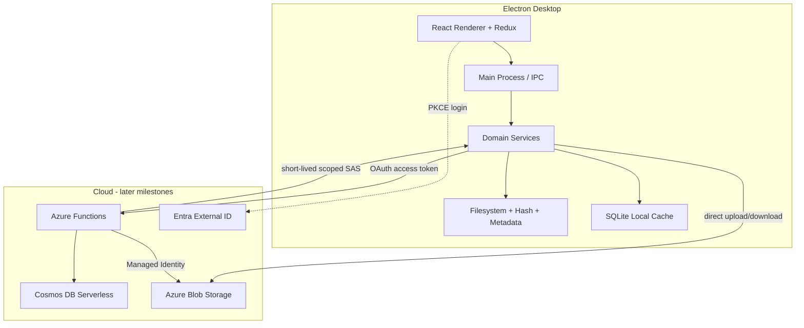
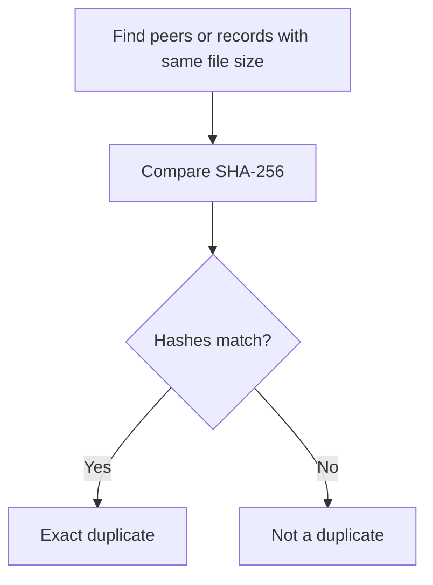
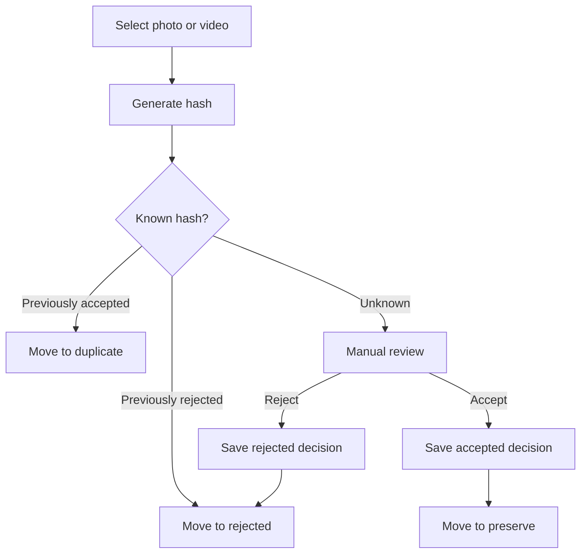
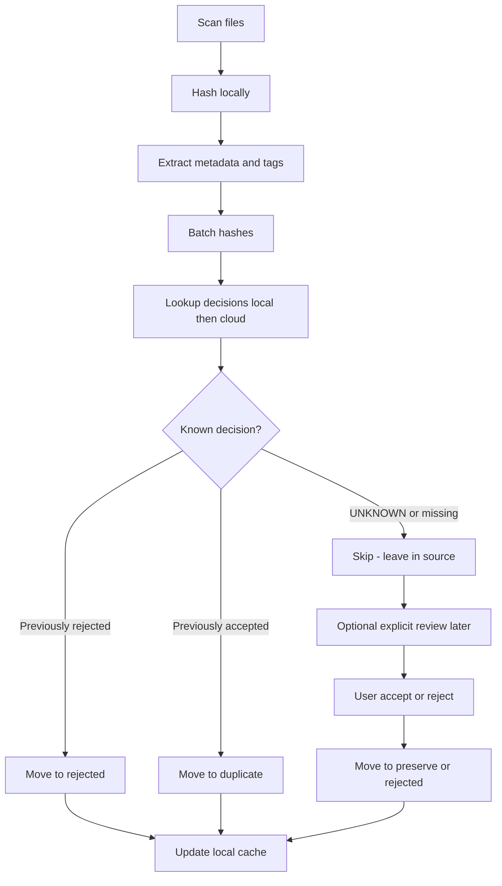
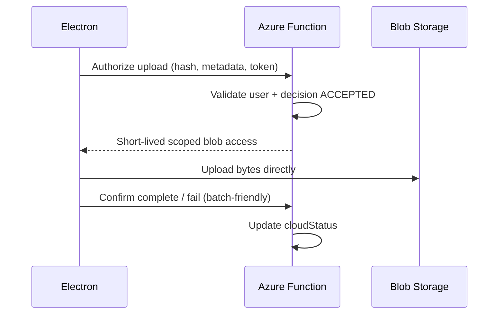
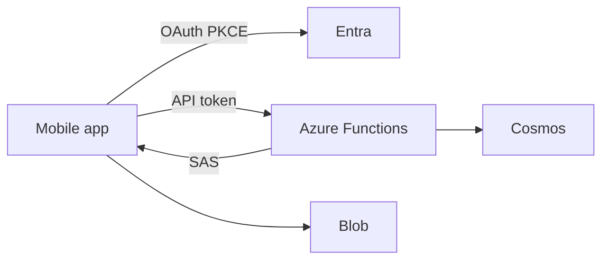

# ARCHITECTURE.md

## Goals

Yaadein keeps filesystem work, hashing, and classification **local**; keeps **cloud metadata for accepted and rejected decisions** as the durable authority for those hashes; transfers large **accepted** media **directly** to object storage; and keeps Electron, React, domain logic, and cloud providers behind clear boundaries. Duplicate classifications are local-only (no extra Cosmos row—the accepted hash already exists). Rejected cloud records are lean (`contentHash` + `fileSize` + decision); rejected bytes are never uploaded to Blob.

This document describes the target architecture. Implementation follows [ROADMAP.md](ROADMAP.md) in desktop-first order: local Electron milestones before Azure.

## High-level system



## Process and layer map

| Layer | Responsibility | Must not |
|-------|----------------|----------|
| **React renderer** | UI, Redux state for progress/review/settings | Call Node FS, hash files, talk to Cosmos/Blob SDKs |
| **Electron main / IPC** | Bridge UI ↔ domain; dialogs; app lifecycle | Embed business rules that belong in domain |
| **Domain services** | Scan orchestration, classification, decision batching, upload/download queues | Import Azure SDKs directly; depend on React |
| **Infrastructure** | FS moves, SHA-256, EXIF/metadata, SQLite, HTTP API client, blob transfer | Leak into Redux components |
| **Cloud API** | AuthZ, batch metadata, issue scoped blob access | Proxy large media bodies through Functions |

### Suggested layout (when code exists)

Desktop-first sequencing; folders appear as milestones require them:

```text
apps/desktop/          # Electron + React (early milestones)
apps/api/              # Azure Functions (later milestones)
packages/shared/       # Optional shared types only when duplication hurts
```

Use `pnpm`. Do not create `packages/shared` until a concrete shared type need appears.

## Electron main process

- Owns privileged Node capabilities (filesystem, SQLite path, spawning heavy work).
- Exposes a narrow IPC surface to the renderer (start scan, get progress, submit decisions, settings).
- Hosts or invokes domain services; may use worker threads for hashing large files.
- Holds non-secret config (client ID, authority, API URL).

## React renderer

- Presents scan progress, review queues, library/restore views, and settings.
- Talks to main only via IPC wrappers.
- Keeps UI state in Redux Toolkit; does not mirror the full authoritative media catalog if avoidable—prefer querying main/domain for lists.

## Redux responsibilities

**In Redux:**

- UI session state: current view, selection, filters
- Scan/upload/download **progress** snapshots for display
- Auth session presentation (signed-in user display; tokens stay in secure main-side storage where practical)
- Settings form state before persistence

**Not in Redux as source of truth:**

- Full media decision catalog (SQLite cache + cloud)
- Retry queues (domain/persistence)
- Raw filesystem paths as business authority beyond settings

## Domain / services layer

Small, testable modules, for example:

- `ScanService` — walk folders, enqueue hash/metadata work
- `HashService` — SHA-256 of full file bytes; always return/pair with `fileSize`
- `MetadataService` — capture date, dimensions, duration, media type, **tags** (`people` / `places` / `events`)
- `ClassificationService` — map hash lookup results → decision actions
- `WorkingFolderService` — ensure tree; compute `YYYY/MM` destinations; safe move
- `DecisionService` — record decisions locally; for `ACCEPTED` and `REJECTED`, batch sync to cloud when online (`DUPLICATE` local-only)
- `CleanupService` — user-initiated deletion of local rejected/duplicate files; retain decisions
- `UploadQueue` / `DownloadQueue` — durable pending transfers with retry (accepted media bytes only)

Domain depends on interfaces, not Azure SDKs.

## Filesystem layer

- Discover photos/videos under user-selected roots (extension + light type checks; refine as needed).
- **Move-on-classify:** `rename` when same volume; cross-volume = copy + verify hash + delete source only after verify.
- Never permanently delete as an **automatic** product action. Rejected/duplicate media remain on disk under the working folder until the user runs **explicit cleanup**.
- `CleanupService` (domain): delete selected/all files under `rejected/` and/or `duplicate/` only; require confirmation at the UI/IPC boundary; update local cache paths/availability; **retain** hash → decision so future scans still classify correctly. Do not touch `preserve/` or Blob objects.
- Crash safety: prefer verify-after-move; leave clear incomplete markers or temp names if a move is interrupted (implementation detail in milestone tests).

### Working folder layout

```text
{workingRoot}/
├── preserve/YYYY/MM/
├── duplicate/YYYY/MM/
└── rejected/YYYY/MM/
```

Capture date for path:

1. EXIF / media metadata capture date
2. else filesystem `mtime`
3. else filesystem `ctime`

Filename collisions in the same month folder: disambiguate with a short content-hash prefix (or equivalent) while preserving a recognizable original name when possible.

## Metadata extraction

- Photos: EXIF (and similar) for capture date, width, height.
- Videos: container/metadata libraries for duration and best-effort capture date.
- **Tags (MVP):** during the same local processing pass, populate:

```text
tags: {
  people: string[]
  places: string[]
  events: string[]
}
```

  Best-effort from embedded EXIF/XMP/IPTC (and equivalents), GPS/location → places, and event/keyword fields when present. Empty arrays when unknown; never fail the scan solely for missing tags.
- Store extracted fields (including tags) in cache/cloud records; treat missing fields as allowed.

## Hashing and file size

- **Content hash (`contentHash`):** SHA-256 over entire file contents. **Primary content identity** for decisions, duplicate confirmation, and transfer verification.
- **File size (`fileSize`):** always stored with the hash. Useful for candidate narrowing, recoverable-storage UI, incomplete/corrupt detection, avoiding unnecessary lookups, and displaying media info.
- **Size alone never proves duplication**—different files can share a size.
- **Perceptual hash:** deferred post-MVP.

### Exact duplicate-check sequence



1. Look for records with the same file size.
2. Compare SHA-256 hashes.
3. Consider files exact duplicates **only when the hashes match**.

If a computed hash matches a stored `contentHash` but `fileSize` differs, treat as an integrity anomaly (do not silently merge).

## Classification

### Media review workflow

High-level per-file picture (easiest mental model):



Notes:

- Previously **accepted** hash → this copy is a **duplicate** (not a second accept).
- Previously **rejected** hash → move to `rejected/` again (decision already known).
- **Accept** / **Reject** persist locally and sync to Cosmos (`ACCEPTED` full, `REJECTED` lean); only accepted uploads to Blob.
- **Duplicate** does not create a new Cosmos document.

### Batch scan flow

How automatic scanning applies the same rules in batches:



Rules:

- Previously rejected / accepted recognized by hash.
- Exact duplicates: size candidates → SHA-256 confirm (see hashing section).
- Unknown skipped on automatic scan; user can review explicitly.
- Accepted → `preserve`; Rejected → `rejected`; Duplicate → `duplicate`.
- Extracted tags are stored with the local media record and shown during review when available.
- Cloud writes: `ACCEPTED` → full Cosmos doc + Blob; `REJECTED` → lean Cosmos decision doc (no Blob); `DUPLICATE` → no Cosmos row.

## Local cache (SQLite)

Purpose:

- Hash → decision lookup acceleration (accepted, rejected, duplicate)
- Cached metadata including `tags` and `fileSize`
- Scan progress
- Pending uploads / downloads (accepted bytes only)
- Offline queue for accepted/rejected cloud sync

Useful constraint:

```text
UNIQUE(content_hash, file_size)
```

`content_hash` remains the primary content identity; pairing size in the unique constraint adds a simple integrity check.

**Not authoritative** when cloud is enabled for accepted/rejected decisions. Disposable and rebuildable from cloud (+ local filesystem inventory) where practical. Duplicate classifications are re-derived when a hash matches an accepted record.

Avoid designing a complex bidirectional sync engine. Prefer:

```text
Cloud metadata (accepted + rejected)
        ↓
Local rebuildable cache
```

On reconnect: push queued **accepted** and **rejected** upserts (batch); push accepted uploads; pull/refresh cache from cloud; last-write-wins by `updatedAt`. Do not upsert duplicate documents to Cosmos.

## Authentication

- Microsoft **Entra External ID**
- OAuth **Authorization Code + PKCE**
- Electron obtains access tokens for the API audience
- Azure Functions validate the bearer token
- No client secrets in the desktop app

## Cloud API (Azure Functions)

Authenticated API layer responsibilities:

- Batch lookup of decisions by content hash (**accepted** and **rejected**)
- Batch upsert of **accepted** (full meta/tags) and **rejected** (lean decision) documents
- Authorize and return **short-lived scoped** Blob access for **accepted** upload/download only
- Use **Managed Identity** to Cosmos and Storage—no keys in app settings that the client can steal
- Reject requests that attempt to create cloud records for `DUPLICATE`, or Blob grants for non-accepted media

Functions **must not** stream large media bodies; they authorize and record metadata.

### Preferred upload flow



### Preferred download / restore flow

```mermaid
sequenceDiagram
  participant E as Electron
  participant F as Azure Function
  participant B as Blob Storage
  E->>F: Authorize download (ids or year/month filter)
  F-->>E: Short-lived scoped read access + metadata
  E->>B: Download bytes directly
  E->>E: Hash-verify; place under preserve/YYYY/MM
  E->>F: Ack success / fail as needed
```

## Cosmos DB

- Serverless account for **accepted** (full) and **rejected** (lean) media decision documents.
- **Partition key:** `/userId`.
- **Document key `id`:** equals `contentHash` for point reads (convenience only).
- **Required separate fields on every accepted and rejected document:** `contentHash` (string) and `fileSize` (number). Do not omit `contentHash` because it matches `id`. Do not omit `fileSize`.
- Tags and rich media fields are required for accepted documents; rejected documents are lean but still include `contentHash` and `fileSize`.
- No documents for duplicate classifications.

### What is stored where

| Decision    | Local SQLite + working folder | Cosmos | Blob |
|-------------|-------------------------------|--------|------|
| `ACCEPTED`  | Yes                           | Yes (full + tags) | Yes |
| `REJECTED`  | Yes                           | Yes (lean) | No |
| `DUPLICATE` | Yes (`duplicateOf` local)     | No     | No   |

Duplicate detection: if the hash already exists as an **accepted** record (local and/or Cosmos), classify the new file as `DUPLICATE` locally and move it; do not write a second cloud document.

### Canonical accepted media document

```json
{
  "id": "<sha256>",
  "userId": "<entra-oid>",
  "contentHash": "<sha256>",
  "fileSize": 4821934,
  "decision": "ACCEPTED",
  "decisionTimestamp": "2026-09-05T22:00:00.000Z",
  "captureDate": "2026-07-18T15:30:00.000Z",
  "mediaType": "image/jpeg",
  "originalFilename": "IMG_1234.jpg",
  "width": 4032,
  "height": 3024,
  "duration": null,
  "tags": {
    "people": ["Aaryan", "Thanuja"],
    "places": ["Yellowstone"],
    "events": ["Summer Vacation"]
  },
  "cloudObjectId": "<userId>/<sha256>",
  "cloudStatus": "SYNCED",
  "createdAt": "2026-09-05T22:00:00.000Z",
  "updatedAt": "2026-09-05T22:10:00.000Z"
}
```

### Canonical rejected decision document

```json
{
  "id": "<sha256>",
  "userId": "<entra-oid>",
  "contentHash": "<sha256>",
  "fileSize": 4821934,
  "decision": "REJECTED",
  "decisionTimestamp": "2026-09-05T22:00:00.000Z",
  "cloudStatus": "NOT_REQUIRED",
  "createdAt": "2026-09-05T22:00:00.000Z",
  "updatedAt": "2026-09-05T22:00:00.000Z"
}
```

Video accepted example: set `mediaType` to `video/mp4`, populate `duration` (seconds), and omit unused dimension fields or set them null. Always include `tags` with arrays (possibly empty) on accepted docs. Use `captureDate` for `YYYY/MM` paths—not a separate `eventDate` field.

## Blob Storage

- Stores **accepted** media objects only (MVP).
- Object keys derived from stable ids / content hash (implementation in upload milestone).
- Access only via short-lived scoped credentials issued by Functions (or Managed Identity server-side for admin ops—not from Electron).

## Retry handling

- Uploads/downloads: retry with backoff; refresh SAS if expired.
- Moves: verify hash after cross-volume copy before removing source.
- Offline **accepted/rejected** decision sync: queue locally; flush in batches when online.
- Interrupted scan: resume from durable scan progress in SQLite where practical.

## Provider abstractions (thin, MVP-only)

Introduce only where they prevent Azure types from leaking into domain:

| Abstraction | Role |
|-------------|------|
| `CloudApiClient` | Batch lookup/upsert, request upload/download grant |
| `ObjectStorageProvider` | Put/get/verify using granted access |
| `MediaRepository` | Optional façade over cache + API for “get decision by hash” |

Initial implementations are Azure-specific. Do **not** build multi-cloud frameworks for S3/GCS until a real second provider is required.

## Separation of concerns

| Concern | Owner |
|---------|--------|
| Decision (`ACCEPTED` / `REJECTED` in cloud; `DUPLICATE` local-only) | Product / metadata |
| `cloudStatus` (`SYNCED` / `FAILED` / `NOT_REQUIRED` / …) | Upload pipeline (blob for accepted only) |
| Local availability | Local inventory + download pipeline |
| Media bytes transfer | Direct blob I/O (accepted only) |
| Metadata CRUD | Functions + Cosmos (accepted full; rejected lean) |
| Tags extraction | Local metadata processing |

Valid example: Decision `ACCEPTED` + `cloudStatus` `FAILED`.

## Future mobile architecture



- Same Functions API, Cosmos schema, Blob containers, and auth tenant.
- No Electron; local FS/cache differ by platform.
- Desktop-first milestones must not invent Electron-only API contracts that block mobile (prefer JSON over HTTP; avoid desktop-only session assumptions in the API).

## Architectural risks

| Risk | Mitigation |
|------|------------|
| Crash mid-move / cross-volume move | Copy → hash verify → delete source; tests for incomplete moves |
| Hashing blocks UI | Main process / worker threads; progress events |
| SAS / token expiry mid-transfer | Refresh grant; retry queue |
| Offline divergence | Queues + cloud authority + last-write-wins; no CRDT |
| Path collisions in `YYYY/MM` | Hash-prefix disambiguation |
| Users expect original paths restored | Product clear: restore rebuilds `preserve/` only |
| Permanent deletion of preserve or auto-delete on scan | Only user-confirmed cleanup of rejected/duplicate locals |

## Related documents

- [PRODUCT.md](PRODUCT.md)
- [ROADMAP.md](ROADMAP.md)
- [AGENTS.md](AGENTS.md)
