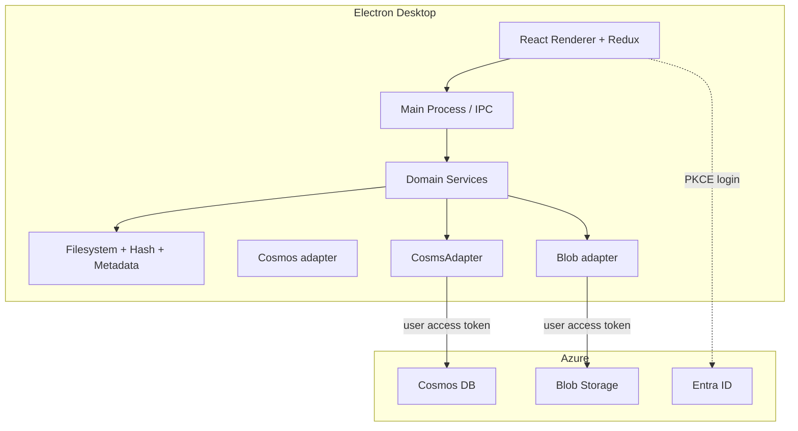

# ARCHITECTURE.md

## Goals

Yaadein keeps filesystem work, hashing, and moves **local**; keeps **Cosmos** as the decision store for accepted/rejected; uploads **accepted** media to **Blob**; moves into `preserve/` only after Blob `SYNCED`.

**Solo MVP auth model:** Electron signs the user in with **Entra ID (PKCE)** and calls Cosms/Blob SDKs with the **user access token** under Azure RBAC. **No Azure Functions** and **no account keys** in the app. Functions may return later for multi-user/untrusted clients.

## High-level system



## Process and layer map

| Layer | Responsibility | Must not |
|-------|----------------|----------|
| React renderer | UI / Redux presentation | FS, hashing, Azure SDKs, tokens |
| Electron main / IPC | Bridge; dialogs; token cache | Business rules that belong in domain |
| Domain | Scan, classify, accept pipeline | Import Azure SDK types deeply; hold account keys |
| Infrastructure adapters | Cosms/Blob SDK + token provider | Leak into React |
| Entra | User authentication | — |

### Layout

```text
apps/desktop/     # Electron + React (MVP)
apps/api/         # Not required for solo MVP (Functions postponed)
```

## Auth and Azure access

- Public client + PKCE; tokens in main-process cache; redirect `http://localhost`
- Cosms and Blob data-plane access via **Azure RBAC on the signed-in user**
- MSAL scopes include resource scopes for Cosms and Storage as needed (plus optional Graph for `/me`)
- Never store Cosms/storage account keys in the app (including “encrypted” local files)
- Operator setup (Entra app, Cosms container, Blob container, RBAC roles) is documented in [README.md](README.md) **Prerequisites**

## Domain sketch

- `ScanService`, `HashService`, `MetadataService`, `ClassificationService`, `WorkingFolderService`
- `DecisionRepository` — Cosms lookup/upsert (accepted full / rejected lean)
- `AcceptPipeline` — Cosms upsert → Blob upload → `SYNCED` → move `preserve/`
- `CleanupService`, `DownloadQueue`

## Classification / accept flow

Same product workflow as [PRODUCT.md](PRODUCT.md): Cosms lookup → auto-move known; accept only after Blob `SYNCED`.

## Cosms DB

- Serverless NoSQL; database `yaadein`; container `media`; partition `/userId`
- Required fields: `contentHash`, `fileSize`
- No duplicate documents

## Blob Storage

- Accepted media only; user token + data-plane RBAC

## Explicitly not in solo MVP

- Azure Functions gateway
- Local SQL decision cache
- Account-key material in Electron

## Architectural risks

| Risk | Mitigation |
|------|------------|
| Over-privileged user RBAC | Tight roles; single-user tenant; revisit Functions if sharing |
| Token expiry mid-upload | MSAL silent refresh; retry |
| Move before SYNCED | Gate preserve move on status |
| Accidental key embedding | Lint/review; config is endpoints + container names only |

## Related documents

- [PRODUCT.md](PRODUCT.md)
- [ROADMAP.md](ROADMAP.md)
- [AGENTS.md](AGENTS.md)
