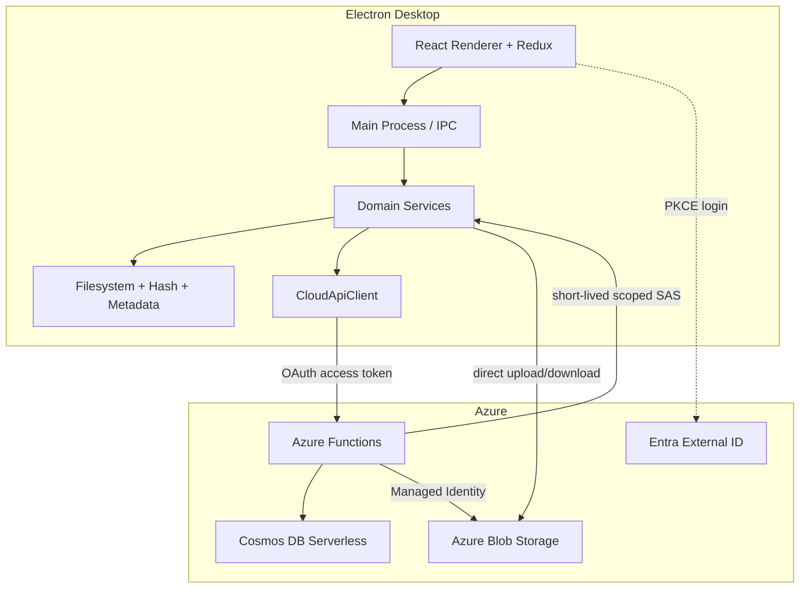
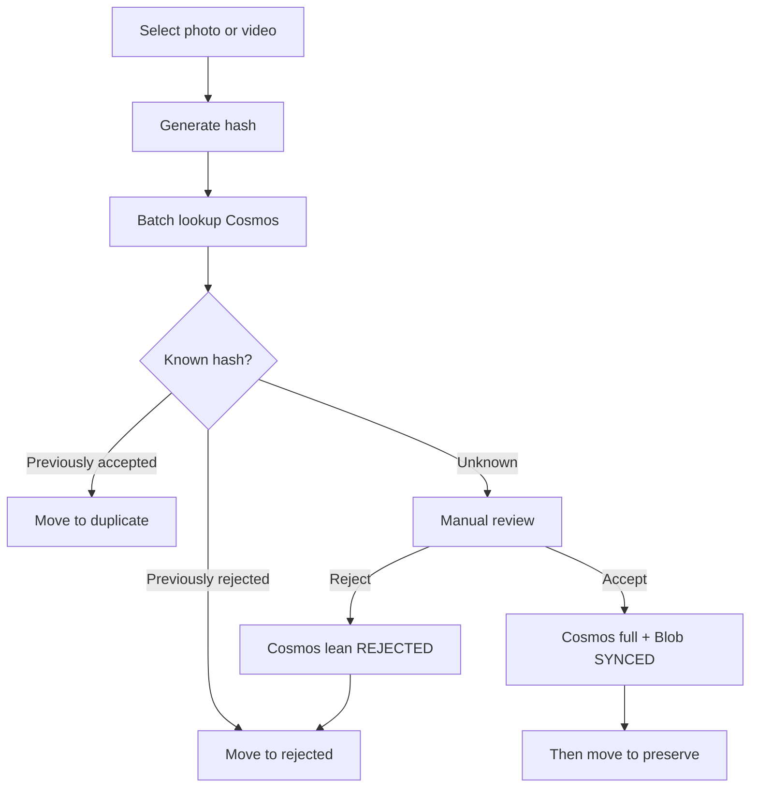
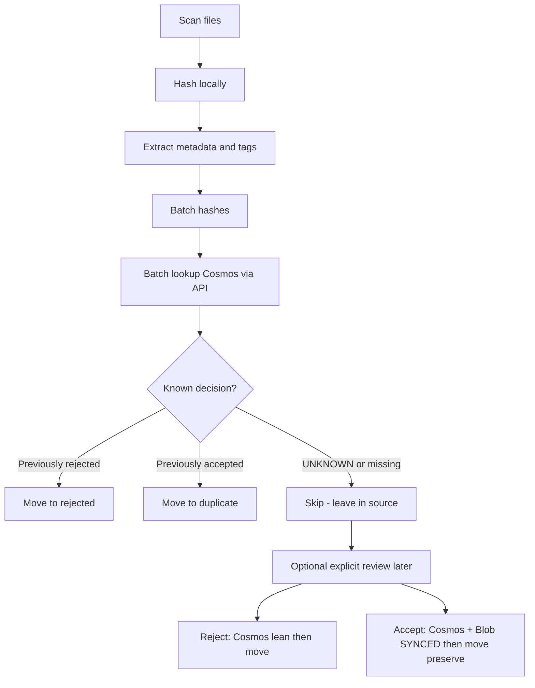

# ARCHITECTURE.md

## Goals

Yaadein keeps filesystem work, hashing, and moves **local**; keeps **Cosmos** (via Azure Functions) as the **only decision store** for accepted and rejected hashes; transfers large **accepted** media **directly** to Blob; and moves accepted files into local `preserve/` **only after** Blob upload reaches `SYNCED`. Duplicate classifications are local-only (no extra Cosmos row). Rejected cloud records are lean; rejected bytes never go to Blob. There is **no local SQL decision cache** in MVP.

Implementation follows [ROADMAP.md](ROADMAP.md): cloud auth/API/Blob before scan/classify/accept that depend on them.

## High-level system



## Process and layer map

| Layer | Responsibility | Must not |
|-------|----------------|----------|
| **React renderer** | UI, Redux for progress/review/settings | Call Node FS, hash files, talk to Cosmos/Blob SDKs |
| **Electron main / IPC** | Bridge UI ↔ domain; dialogs; app lifecycle | Embed business rules that belong in domain |
| **Domain services** | Scan, classification, accept/reject orchestration, upload/download queues | Import Azure SDKs directly; depend on React |
| **Infrastructure** | FS moves, SHA-256, EXIF/metadata, HTTP API client, blob transfer | Leak into Redux components; host a SQL decision DB |
| **Cloud API** | AuthZ, batch metadata, issue scoped blob access | Proxy large media bodies through Functions |

### Suggested layout

```text
apps/desktop/          # Electron + React
apps/api/              # Azure Functions (from Milestone 5)
packages/shared/       # Optional shared types only when duplication hurts
```

Use `pnpm`. Do not create `packages/shared` until a concrete shared type need appears.

## Electron main process

- Owns privileged Node capabilities (filesystem, hashing, spawning heavy work).
- Exposes a narrow IPC surface (sign-in, start scan, submit decisions, settings).
- Hosts domain services; may use worker threads for hashing large files.
- Holds non-secret config (client ID, authority, API URL). Tokens stay main-side where practical.

## React renderer

- Presents scan progress, review queues, library/restore views, and settings.
- Talks to main only via IPC wrappers.
- Keeps UI state in Redux Toolkit; does **not** hold the authoritative decision catalog.

## Redux responsibilities

**In Redux:** UI session, scan/upload/download **progress**, auth presentation, settings form state.

**Not in Redux as source of truth:** Cosms decision catalog, retry queues, raw filesystem paths as business authority beyond settings.

## Domain / services layer

Examples:

- `ScanService` — walk folders, enqueue hash/metadata work
- `HashService` — SHA-256 + `fileSize`
- `MetadataService` — capture date, dimensions, duration, media type, tags
- `ClassificationService` — map Cosms lookup results → move actions
- `WorkingFolderService` — ensure tree; `YYYY/MM` paths; safe move
- `DecisionService` — Cosms upsert via `CloudApiClient` (accepted full / rejected lean); never SQLite
- `AcceptPipeline` — Cosms upsert → Blob upload → require `SYNCED` → move to `preserve/`
- `CleanupService` — user-initiated delete under `rejected/` / `duplicate/` only; retain Cosms decisions
- `UploadQueue` / `DownloadQueue` — accepted bytes only; retry

Domain depends on interfaces, not Azure SDKs.

## Filesystem layer

- Discover photos/videos under user-selected roots.
- **Safe move:** `rename` when same volume; cross-volume = copy + verify + delete source after verify.
- **Accepted:** move into `preserve/` only after Blob `SYNCED`.
- **Rejected / duplicate:** move after decision is confirmed (Cosms lean write / Cosms accepted hit).
- Never permanently delete as an automatic product action.
- `CleanupService`: delete under `rejected/` and/or `duplicate/` only after confirmation; do not touch `preserve/` or Blob.

### Working folder layout

```text
{workingRoot}/
├── preserve/YYYY/MM/
├── duplicate/YYYY/MM/
└── rejected/YYYY/MM/
```

Capture / event date: user override → EXIF → oldest usable among `mtime` / `birthtime` / `ctime` / `atime`.

## Metadata extraction

Photos/videos: EXIF and container metadata. Tags MVP:

```text
tags: { people: string[], places: string[], events: string[] }
```

Best-effort from embedded metadata/GPS; empty arrays when unknown. Store rich tags on **accepted** Cosms docs.

## Hashing and file size

- `contentHash`: SHA-256 of full bytes — primary identity.
- `fileSize`: always stored with the hash.
- Size alone never proves duplication.
- Duplicate check: same-size candidates → SHA-256 → duplicate only if hashes match.
- Hash match with mismatched `fileSize` → integrity anomaly.

## Classification



### Batch scan flow



Rules:

- Require signed-in + network for classify/accept/reject in MVP.
- Cloud writes: `ACCEPTED` → full Cosms + Blob; `REJECTED` → lean Cosms; `DUPLICATE` → no Cosms row.
- Do not move into `preserve/` before `cloudStatus === SYNCED`.

## No local SQL decision cache

MVP does **not** use SQLite (or any local DB) as a decision store. Session progress may live in memory/Redux. Optional future local acceleration must never become authoritative over Cosms.

## Authentication

- Microsoft **Entra External ID**
- OAuth **Authorization Code + PKCE**
- Electron obtains access tokens for the API audience
- Azure Functions validate the bearer token
- No client secrets in the desktop app

## Cloud API (Azure Functions)

- Batch lookup of decisions by content hash (accepted + rejected)
- Batch upsert of accepted (full) and rejected (lean) documents
- Issue short-lived scoped Blob access for **accepted** upload/download only
- Managed Identity to Cosms and Storage
- Reject `DUPLICATE` cloud creates and Blob grants for non-accepted media
- Functions must not stream large media bodies

### Preferred accept / upload flow

```mermaid
sequenceDiagram
  participant E as Electron
  participant F as Azure Function
  participant B as Blob Storage
  E->>F: Upsert ACCEPTED metadata + authorize upload
  F->>F: Validate user + write Cosmos
  F-->>E: Short-lived scoped blob access
  E->>B: Upload bytes directly
  E->>F: Confirm complete / fail
  F->>F: Update cloudStatus SYNCED or FAILED
  alt SYNCED
    E->>E: Move file to preserve/YYYY/MM
  else FAILED
    E->>E: Leave source unmoved; allow retry
  end
```

### Preferred download / restore flow

```mermaid
sequenceDiagram
  participant E as Electron
  participant F as Azure Function
  participant B as Blob Storage
  E->>F: Authorize download
  F-->>E: Scoped read access + metadata
  E->>B: Download bytes directly
  E->>E: Hash-verify; place under preserve/YYYY/MM
```

## Cosmos DB

- Serverless for **accepted** (full) and **rejected** (lean) documents.
- Partition `/userId`.
- `id` may equal `contentHash` for point reads only.
- Required separate fields: `contentHash`, `fileSize`.
- No documents for duplicates.

### What is stored where

| Decision    | Working folder | Cosms | Blob |
|-------------|----------------|-------|------|
| `ACCEPTED`  | `preserve/` after `SYNCED` | Yes (full + tags) | Yes |
| `REJECTED`  | `rejected/` after Cosms write | Yes (lean) | No |
| `DUPLICATE` | `duplicate/` | No | No |

### Canonical accepted media document

```json
{
  "id": "<sha256>",
  "userId": "<entra-oid>",
  "contentHash": "<sha256>",
  "fileSize": 4821934,
  "decision": "ACCEPTED",
  "decisionTimestamp": "2026-09-05T22:00:00.000Z",
  "captureDate": "2026-07-18T15:30:00.000Z",
  "mediaType": "image/jpeg",
  "originalFilename": "IMG_1234.jpg",
  "width": 4032,
  "height": 3024,
  "duration": null,
  "tags": {
    "people": ["Aaryan", "Thanuja"],
    "places": ["Yellowstone"],
    "events": ["Summer Vacation"]
  },
  "cloudObjectId": "<userId>/<sha256>",
  "cloudStatus": "SYNCED",
  "createdAt": "2026-09-05T22:00:00.000Z",
  "updatedAt": "2026-09-05T22:10:00.000Z"
}
```

### Canonical rejected decision document

```json
{
  "id": "<sha256>",
  "userId": "<entra-oid>",
  "contentHash": "<sha256>",
  "fileSize": 4821934,
  "decision": "REJECTED",
  "decisionTimestamp": "2026-09-05T22:00:00.000Z",
  "cloudStatus": "NOT_REQUIRED",
  "createdAt": "2026-09-05T22:00:00.000Z",
  "updatedAt": "2026-09-05T22:00:00.000Z"
}
```

Conflict policy: last-write-wins by `updatedAt`.

## Blob Storage

- Stores **accepted** media objects only.
- Access via short-lived scoped credentials from Functions.

## Retry handling

- Uploads/downloads: backoff; refresh SAS if expired.
- Accept failure: no preserve move; retry upload.
- Moves: verify after cross-volume copy before removing source.
- MVP does not queue offline decisions.

## Provider abstractions (thin, MVP-only)

| Abstraction | Role |
|-------------|------|
| `CloudApiClient` | Batch lookup/upsert, request upload/download grant |
| `ObjectStorageProvider` | Put/get/verify using granted access |

Do not build multi-cloud frameworks until a second provider is required.

## Separation of concerns

| Concern | Owner |
|---------|--------|
| Decision | Cosms via Functions (`DUPLICATE` local-only) |
| `cloudStatus` | Upload pipeline |
| Local availability | Local inventory + download pipeline |
| Media bytes | Direct blob I/O (accepted only) |
| Tags extraction | Local metadata processing |

## Future mobile architecture

Same Functions API, Cosms schema, Blob containers, and auth tenant. Prefer JSON over HTTP; avoid Electron-only API contracts.

## Architectural risks

| Risk | Mitigation |
|------|------------|
| Move to preserve before upload completes | Gate move on `SYNCED`; tests for ordering |
| Crash mid-move / cross-volume | Copy → verify → delete source |
| Hashing blocks UI | Main/workers; progress events |
| SAS expiry mid-transfer | Refresh grant; retry queue |
| No offline decisions | Product: require online for classify/accept |
| Path collisions | Hash-prefix disambiguation |
| Expect original paths restored | Product: restore rebuilds `preserve/` only |

## Related documents

- [PRODUCT.md](PRODUCT.md)
- [ROADMAP.md](ROADMAP.md)
- [AGENTS.md](AGENTS.md)
