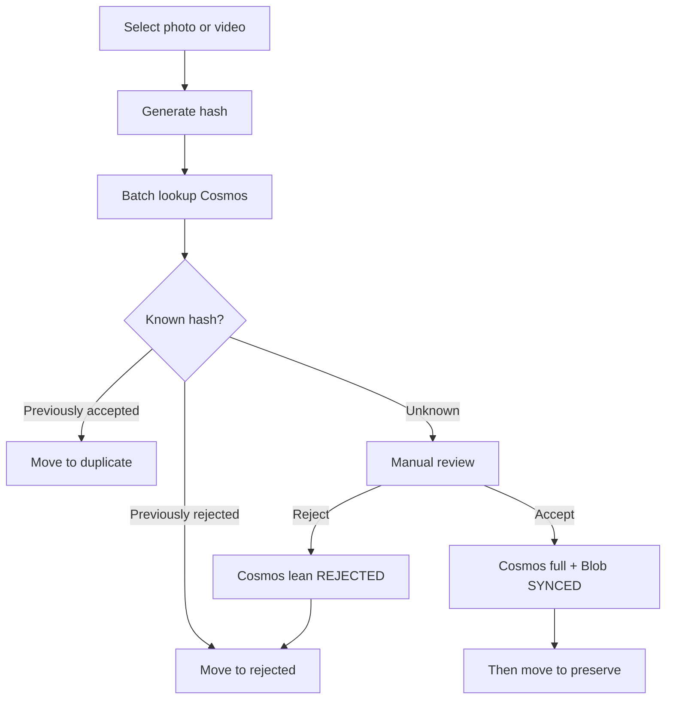

# PRODUCT.md

## Product purpose

**Yaadein** is a desktop application that helps people clear digital photo and video clutter while preserving the media they care about.

Users select folders of photos and videos. Yaadein hashes files locally, looks up and writes decisions in **Cosmos** using the signed-in **Entra user** identity, and organizes files into a local working folder. **Accepted** media are written to Cosms (full metadata + tags) and uploaded to Blob **before** they are moved into local `preserve/`. **Rejected** hashes are stored in Cosms as lean decision records (no Blob). **Duplicate** files do not get their own cloud documents. There is **no local SQL decision cache** and **no Azure Functions** in the solo MVP—the desktop app uses Azure RBAC with the user access token. **No Cosms or storage account keys** are stored in the app.

MVP is **single-user / personal**. Multi-user or untrusted clients may later introduce an API tier; that is out of scope now.

## Target user

People (initially: you) with large, messy photo/video collections who want to:

- Reduce digital junk without accidentally losing cherished memories
- Remember accept/reject decisions in Cosms across machines you sign into
- Keep accepted media in Blob and rebuild local `preserve/` when needed

**Scan, classify, accept, and reject require sign-in and network access** in MVP.

## Core workflows

### 1. Configure, sign in, and scan

1. Choose a **Yaadein working folder**.
2. Sign in with Entra ID (PKCE).
3. Select source folders; scan locally (discover, metadata, hashes).
4. **Batch-lookup hashes in Cosms** with the user token.
5. Classify known media; leave **UNKNOWN** for review.

### 2. Classify and organize

| Decision   | Meaning | Working subfolder | Cloud |
|------------|---------|-------------------|-------|
| `UNKNOWN`  | Not decided | (stays in source) | None |
| `ACCEPTED` | Keep | `preserve/` | Full Cosms + Blob, **then** move |
| `REJECTED` | Junk | `rejected/` | Lean Cosms, then move |
| `DUPLICATE`| Exact copy of accepted | `duplicate/` | No new Cosms doc; move locally |

**Move rules:** Reject/Duplicate after Cosms confirmation; Accept only after Blob `SYNCED`. Never auto-delete permanently.

### 3. Review unknowns



### 4. Local cleanup

User-confirmed delete under `rejected/` and/or `duplicate/` only; never `preserve/`; retain Cosms decisions.

### 5. Cloud preserve

- **ACCEPTED** — Cosms full + Blob; local `preserve/` after `SYNCED`
- **REJECTED** — Cosms lean only
- **DUPLICATE** — local move only
- Cosms is authoritative for accepted/rejected

### 6. Restore

Download accepted media with the user token into `preserve/YYYY/MM`, hash-verify, retry.

## Local working folder

```text
Yaadein/
├── preserve/
├── duplicate/
└── rejected/
```

Organize by `YYYY/MM`: user override → EXIF → oldest usable `mtime` / `birthtime` / `ctime` / `atime`.

## Functional requirements

1. Scan user-selected folders.
2. Hash/metadata/moves locally; **decision lookup/write via Cosms SDK + Entra user token**.
3. SHA-256 + `fileSize` always paired.
4. Tags `people` / `places` / `events` during local processing.
5. Remember accepted/rejected in Cosms; treat accepted hash matches as duplicates.
6. Exact duplicates only when hashes match (size narrows candidates only).
7. Accepted move only after Blob `SYNCED`.
8. User-initiated cleanup of rejected/duplicate locals; retain Cosms decisions.
9. Review unknowns with tags shown.
10. Prefer batch Cosms operations.
11. No Cosms/storage **account keys** or Function keys in the app.

## Non-functional requirements

- Solo MVP: desktop + Entra user RBAC to Cosms/Blob
- No privileged account keys in Electron
- Integrity via content hash; retries on upload/download
- No local SQL decision cache in MVP

## Decision vs cloud vs local availability

Keep `decision`, `cloudStatus`, and local availability separate.

## MVP scope (M1–M12 — complete)

### In scope (delivered)

- Electron + React + Redux + TypeScript
- Working folder + hash/metadata/tags
- Entra ID PKCE sign-in
- Cosms via user token; Blob via user token
- Scan/classify/review; accept-after-upload; cleanup; restore

### Explicitly out of scope (MVP plumbing)

- Azure Functions as required gateway
- Local SQL decision cache; offline decision queues
- Encrypted account-key files in the app
- Public multi-tenant CIAM; mobile; multi-user sharing
- Perceptual near-duplicates; auto-delete on scan

## Product UX phase (M13–M18)

Post-MVP product experience on top of the cloud-backed desktop core. Details and ordering live in [ROADMAP.md](ROADMAP.md).

| Milestone | Intent |
|-----------|--------|
| **M13** | Mac and Windows executables / installers (**Done**) |
| **M14** | Home (scan or view media); persist working folder—do not re-prompt if already set (**Done**) |
| **M15** | Tinder-style unknown review: playable media; ←/→ navigate; ↑ accept; ↓ reject (**Done**) |
| **M16** | Rejected grid by year/month; delete; **accept** a rejected file (Cosms + Blob → `preserve/`) |
| **M17** | Duplicate vs original side by side; ←/→ navigate; ↓ delete duplicate |
| **M18** | View media (cherish); multi-select tag filters |

**Product rules that still apply:** accept only after Blob `SYNCED`; Cosms authoritative for accepted/rejected; no Cosms DUPLICATE docs; no account keys; no local SQL decision cache.

## Cloud metadata

Every Cosms media document must include separate `contentHash` and `fileSize`. Partition `/userId`. `id` may equal `contentHash` for point reads only.

| Decision | Cosms | Blob | Local move |
|----------|-------|------|------------|
| `ACCEPTED` | Full + tags | Yes (`SYNCED`) | `preserve/` after `SYNCED` |
| `REJECTED` | Lean | No | `rejected/` after Cosms write |
| `DUPLICATE` | No | No | `duplicate/` |
| `UNKNOWN` | No | No | None |

## Related documents

- [ARCHITECTURE.md](ARCHITECTURE.md)
- [ROADMAP.md](ROADMAP.md)
- [AGENTS.md](AGENTS.md)
