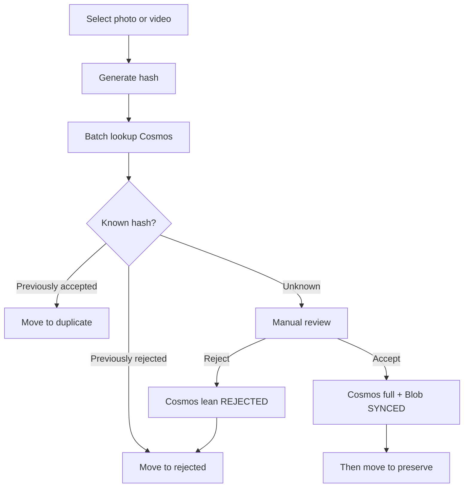

# PRODUCT.md

## Product purpose

**Yaadein** is a desktop application that helps people clear digital photo and video clutter while preserving the media they care about.

Users select folders of photos and videos. Yaadein hashes files locally, looks up decisions in **Cosmos** (via an authenticated API), and organizes files into a local working folder. **Accepted** media are written to Cosmos (full metadata + tags) and uploaded to Blob **before** they are moved into local `preserve/`. **Rejected** hashes are stored in Cosmos as lean decision records (no Blob). **Duplicate** files do not get their own cloud documents—the accepted hash already exists. There is **no local SQL decision cache**; Cosmos is the decision authority.

## Target user

People with large, messy collections of photos and videos across folders and devices who want to:

- Reduce digital junk without accidentally losing cherished memories
- Make accept / reject / duplicate decisions once and have them remembered in the cloud
- Keep accepted media safely in object storage and rebuild a local preserve library when needed

MVP focuses on a **single-user desktop** experience. Multi-user sharing and mobile clients are future work. **Scan, classify, accept, and reject require sign-in and network access** in MVP (no offline decision catalog).

## Core workflows

### 1. Configure, sign in, and scan

1. Choose a configurable **Yaadein working folder**.
2. Sign in (Entra External ID + PKCE).
3. Select one or more source folders containing photos and videos.
4. Scan files locally: discover media, extract metadata, compute content hashes.
5. **Batch-lookup hashes in Cosmos** (accepted + rejected).
6. Classify known media automatically; leave **UNKNOWN** for later review.

### 2. Classify and organize

| Decision   | Meaning                                      | Working subfolder | Cloud |
|------------|----------------------------------------------|-------------------|-------|
| `UNKNOWN`  | Not yet decided; skipped until explicit review | (stays in source until reviewed) | None |
| `ACCEPTED` | Keep / cherish                               | `preserve/`       | Full Cosmos + Blob, **then** move |
| `REJECTED` | Digital junk; do not preserve                | `rejected/`       | Lean Cosmos, then move |
| `DUPLICATE`| Exact duplicate of known accepted media      | `duplicate/`      | No new Cosmos doc; move locally |

**Move rules (locked):**

- **REJECTED** — upsert lean Cosmos document, then **move** to `rejected/YYYY/MM`.
- **DUPLICATE** — when hash matches an accepted Cosmos document, **move** to `duplicate/YYYY/MM` (no new Cosmos row).
- **ACCEPTED** — upsert full Cosmos document, upload bytes to Blob until `cloudStatus` is `SYNCED`, **then** **move** to `preserve/YYYY/MM`. If upload fails, leave the source file unmoved and allow retry.
- Files are **never permanently deleted automatically**.

Users may later run an explicit **cleanup** to delete local files under `rejected/` and/or `duplicate/` after they are satisfied with review.

### 3. Review unknowns

- Automatic scan skips `UNKNOWN` media (does not move them).
- Users open an explicit review flow for unknowns.
- Reject or accept follows the move rules above (accept only after cloud upload succeeds).



### 4. Local cleanup (after review)

After decisions are made, users can reclaim disk space with an **explicit, confirmed** cleanup:

- Delete local files in `rejected/` and/or `duplicate/` (all, by period, or selected)
- Never delete `preserve/` via this flow
- Never run cleanup automatically as part of scan or review
- **Keep** Cosms decisions so the same bytes are recognized later without needing the junk files on disk

### 5. Cloud preserve

- **ACCEPTED** — full metadata + tags in Cosmos; bytes uploaded to Blob; local `preserve/` only after `SYNCED`.
- **REJECTED** — lean Cosms decision record with `contentHash` + `fileSize` + `decision: REJECTED`; **no** Blob.
- **DUPLICATE** — no new Cosms document; move locally to `duplicate/`.
- Cosms is authoritative for accepted/rejected decisions.
- Decision (`ACCEPTED`) and cloud sync status (`SYNCED`, `FAILED`, etc.) stay separate. Rejected docs use `cloudStatus: NOT_REQUIRED`.

### 6. Restore / download accepted media

Users can download one item, a selection, by year/month, or restore all accepted media into `preserve/YYYY/MM` on a new computer. Downloads are hash-verified, skip unnecessary duplicates, and support retries.

## Local working folder

Configurable root (default name conceptually `Yaadein/`):

```text
Yaadein/
├── preserve/
├── duplicate/
└── rejected/
```

Within each branch, organize by capture date: `YYYY/MM`.

**Capture / event date for `YYYY/MM`:**

1. **User override** when provided
2. Else EXIF or equivalent media metadata
3. Else the **oldest usable** filesystem timestamp among `mtime`, `birthtime`, `ctime`, and `atime`

Users must be able to override the event/organize date. Path collisions under the same `YYYY/MM` are disambiguated (for example with a content-hash prefix).

## Functional requirements

1. Scan user-selected folders for photos and videos.
2. Process discovery, hashing, metadata, and moves locally; **decision lookup/write goes to Cosms** via the API.
3. Generate reliable **SHA-256** content hashes locally; always record **file size** alongside the hash.
4. Extract **tags** into `people`, `places`, and `events` during local media processing (empty arrays when unknown).
5. Remember previously accepted and rejected media by content hash **in Cosms**; treat hashes that match accepted docs as duplicates locally.
6. Recognize exact duplicates only when **SHA-256 hashes match**, using file size to narrow candidates—never treat size alone as proof.
7. Organize decided media into the local working folder by move, with **accepted move only after Blob `SYNCED`**.
8. Never permanently delete media **automatically**; allow **user-initiated** cleanup of local `rejected/` and `duplicate/` after confirmation (Cosms decisions retained).
9. Allow explicit review of `UNKNOWN` media (including showing extracted tags).
10. Persist **accepted** metadata (including tags) and **rejected** lean docs in Cosms; do not create cloud documents for duplicates.
11. Preserve accepted media in Blob; never upload rejected/duplicate bytes to Blob.
12. Authorize uploads/downloads via an authenticated API; transfer large media directly to/from object storage using short-lived scoped access.
13. Support restore/download of accepted media with hash verification and retries.
14. Prefer batch cloud operations over one request per file.
15. Keep the design compatible with a future mobile client using the same backend.

## Non-functional requirements

- **Local processing** for filesystem, hashing, and moves; **cloud required** for decision lookup and accept/reject in MVP.
- **No privileged Azure credentials** in the Electron app (no Cosms keys, storage keys, client secrets, or privileged function keys). Non-secret config (client ID, authority, API URL) is allowed.
- **Security:** OAuth Authorization Code with PKCE via Microsoft Entra External ID; API uses the access token; Azure Functions use Managed Identity to reach Cosms and Blob.
- **Integrity:** content hashes verify identity and transfers; **file size** always stored with the hash.
- **Resilience:** retries and recoverable interrupted uploads/downloads; failed accept must not leave a half-moved preserve file.
- **Simplicity:** prefer small testable modules; avoid premature abstraction and bidirectional DB sync engines.
- **Performance:** avoid hashing/IO on the React UI thread; batch Cosms lookups; use size to narrow duplicate candidates.
- **No local SQL decision cache** in MVP (optional future acceleration only; never authoritative).

## Decision vs cloud vs local availability

Do **not** mix decision with sync state.

Valid example: Decision `ACCEPTED` + `cloudStatus` `FAILED` (source file still unmoved).

### Decision

`UNKNOWN` | `ACCEPTED` | `REJECTED` | `DUPLICATE`

### Cloud status (accepted media pipeline)

`NOT_REQUIRED` | `PENDING` | `UPLOADING` | `SYNCED` | `FAILED`

### Local availability (may be tracked separately)

`LOCAL_ONLY` | `CLOUD_ONLY` | `LOCAL_AND_CLOUD` | `MISSING` | `DOWNLOAD_PENDING` | `DOWNLOADING` | `DOWNLOAD_FAILED`

## MVP scope

### In scope

- Electron + React + Redux Toolkit + TypeScript desktop app
- Configurable working folder with `preserve` / `duplicate` / `rejected` and `YYYY/MM`
- SHA-256 hashing with **file size**; metadata / tags extraction
- Entra External ID, Azure Functions, Cosms DB Serverless, Blob Storage, SAS-based direct upload/download
- Cosms as the decision store (batch lookup/upsert); **no SQLite decision cache**
- Folder scan + classify from Cosms; skip unknowns
- Review UI: reject after Cosms write; accept after Cosms + Blob `SYNCED` then move to `preserve/`
- Exact duplicate detection: size candidates → SHA-256 confirm
- User-initiated cleanup of local `rejected/` / `duplicate/`
- Restore/rebuild `preserve/` from cloud

### Explicitly out of scope (MVP)

- Local SQLite (or other) **decision** database / offline decision catalog
- Offline accept/reject queues
- Perceptual / near-duplicate detection
- On-device ML face clustering beyond metadata tags
- Rich tag search/browse product surfaces beyond review
- Mobile application; multi-user / family sharing
- **Automatic** permanent deletion during scan/review
- Deleting `preserve/` or cloud blobs via junk cleanup
- Bidirectional DB sync / CRDTs; non-Azure providers
- Restoring to original pre-scan paths
- Soft-delete / OS trash (optional nicety, not required)

## Media tags

Tags are produced during **local media file processing**. For **ACCEPTED** they are stored in Cosms. Rejected Cosms records are lean and do not require rich tag payloads.

```text
tags: {
  people: string[]
  places: string[]
  events: string[]
}
```

## Content identity and duplicate checking

- **Primary content identity:** `contentHash` (SHA-256 of full file bytes).
- **Always store** `fileSize` with the hash.
- **File size alone cannot prove duplication.**

Duplicate-check sequence:

1. Narrow by same file size (optional).
2. Compare SHA-256.
3. Exact duplicate only when hashes match (against Cosms accepted and/or in-batch peers).

Cosms uniqueness is per `userId` + `contentHash` (with `fileSize` always stored). Treat hash + mismatched size as anomalous.

## Cloud metadata (authoritative)

Every Cosms media document **must** include separate top-level fields `contentHash` and `fileSize`. Document `id` may equal `contentHash` for point reads but is **not** a substitute for those fields.

| Decision    | Cosms document | Blob object | Local move |
|-------------|----------------|-------------|------------|
| `ACCEPTED`  | Yes (full + tags) | Yes (`SYNCED` required) | `preserve/` **after** `SYNCED` |
| `REJECTED`  | Yes (lean) | No | `rejected/` after Cosms write |
| `DUPLICATE` | No | No | `duplicate/` when accepted hash exists |
| `UNKNOWN`   | No | No | None |

Conflict policy: **last-write-wins** by `updatedAt`.

## Related documents

- [ARCHITECTURE.md](ARCHITECTURE.md) — system design and boundaries
- [ROADMAP.md](ROADMAP.md) — incremental milestones
- [AGENTS.md](AGENTS.md) — instructions for Cursor agents
