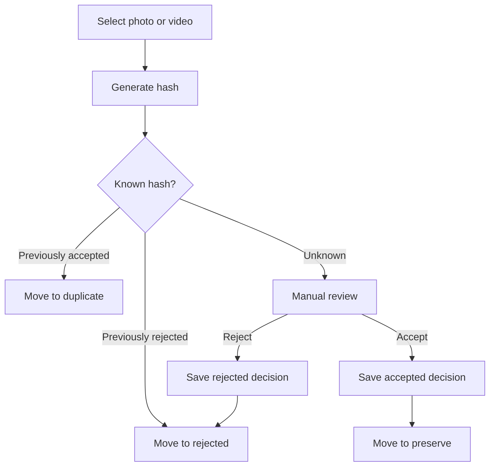

# PRODUCT.md

## Product purpose

**Yaadein** is a desktop application that helps people clear digital photo and video clutter while preserving the media they care about.

Users select folders of photos and videos. Yaadein hashes files locally, recognizes previously accepted, rejected, and duplicate media, and organizes decisions into a local working folder. **Accepted** media are preserved in cloud object storage with rich metadata in Cosmos. **Rejected** hashes are stored in Cosmos as lean decision records (so rejections are recognized on other devices) but are **not** uploaded to Blob. **Duplicate** files do not get their own cloud documents—the accepted hash already exists. The local database remains a disposable cache; for accepted and rejected decisions, cloud metadata is authoritative.

## Target user

People with large, messy collections of photos and videos across folders and devices who want to:

- Reduce digital junk without accidentally losing cherished memories
- Make accept / reject / duplicate decisions once and have them remembered locally; keep accepted media safely in the cloud and rebuild a local preserve library when needed

MVP focuses on a **single-user desktop** experience. Multi-user sharing and mobile clients are future work.

## Core workflows

### 1. Configure and scan

1. Choose a configurable **Yaadein working folder**.
2. Select one or more source folders containing photos and videos.
3. Scan files locally: discover media, extract metadata, compute content hashes.
4. Look up known hashes in batch (local cache first; cloud for **accepted** and **rejected** decision records).
5. Classify known media automatically; leave **UNKNOWN** for later review.

### 2. Classify and organize locally

Supported decision states:

| Decision   | Meaning                                      | Working subfolder |
|------------|----------------------------------------------|-------------------|
| `UNKNOWN`  | Not yet decided; skipped until explicit review | (stays in source until reviewed) |
| `ACCEPTED` | Keep / cherish                               | `preserve/`       |
| `REJECTED` | Digital junk; do not preserve                | `rejected/`       |
| `DUPLICATE`| Exact duplicate of known media               | `duplicate/`      |

**Move-on-classify (locked product rule):** when a user (or automatic classification) decides `ACCEPTED`, `REJECTED`, or `DUPLICATE`, Yaadein **moves** the file from the scanned source folder into the matching working subfolder under `YYYY/MM`. Source folders are cleaned as decisions are made. Files are never permanently deleted automatically.

### 3. Review unknowns

- Automatic scan skips `UNKNOWN` media (does not move them).
- Users can open an explicit review flow for unknowns.
- Accept or reject (or mark duplicate when applicable) moves the file and records the decision.



### 4. Cloud preserve (post-local milestones)

- **ACCEPTED** — full metadata + tags in Cosmos; bytes uploaded to Blob.
- **REJECTED** — lean Cosmos decision record (`id` = hash, `decision: REJECTED`); **no** Blob object and no rich preserve metadata required.
- **DUPLICATE** — no new Cosmos document (the accepted hash already identifies the content); move locally to `duplicate/`.
- Cloud metadata is authoritative for accepted preserve/restore and for recognizing prior rejections.
- For accepted items, decision (`ACCEPTED`) and cloud sync status (`SYNCED`, `FAILED`, etc.) are separate concerns. Rejected cloud docs use `cloudStatus: NOT_REQUIRED`.

### 5. Restore / download accepted media

Users can:

- Download one accepted item
- Download a selection
- Download by year or by month
- Restore all accepted media
- Rebuild the local `preserve` folder on a new computer

Downloaded files are placed under `preserve/YYYY/MM`, hash-verified, skip unnecessary duplicates, and support retries.

## Local working folder

Configurable root (default name conceptually `Yaadein/`):

```text
Yaadein/
├── preserve/
├── duplicate/
└── rejected/
```

Within each branch, organize by capture date:

```text
YYYY/MM
```

Example: `preserve/2026/09/`.

**Capture date preference:** EXIF or equivalent media metadata first; if unavailable, fall back to filesystem `mtime`, then `ctime`.

Path collisions under the same `YYYY/MM` (same original filename) are disambiguated (for example with a content-hash prefix). Exact policy is defined in architecture.

## Functional requirements

1. Scan user-selected folders for photos and videos.
2. Process files locally whenever practical (discovery, hashing, metadata, moves).
3. Generate reliable **SHA-256** content hashes locally.
4. During local media processing, extract **tags** into `people`, `places`, and `events` when identifiable from the file (embedded metadata, GPS/location, and related media fields). Missing tags are allowed (empty lists).
5. Remember previously accepted, rejected, and duplicate media by content hash (local cache for all; cloud stores **accepted** and **rejected**).
6. Recognize exact duplicates via content hash (hash already present as accepted → `DUPLICATE`, no new cloud row).
7. Organize decided media into the local working folder structure by move.
8. Never permanently delete media automatically.
9. Allow explicit review of `UNKNOWN` media (including showing extracted tags).
10. Persist **accepted** media metadata (including tags) and **rejected** decision hashes in Cosmos; do not create cloud documents for duplicates.
11. Preserve accepted media in cloud object storage (when cloud is enabled); never upload rejected/duplicate bytes to Blob.
12. Authorize uploads/downloads via an authenticated API; transfer large media directly to/from object storage using short-lived scoped access.
13. Support restore/download of accepted media with hash verification and retries.
14. Support offline / intermittent connectivity where practical (local queues; cloud authoritative for accepted/rejected decisions on reconnect).
15. Prefer batch cloud operations over one request per file.
16. Keep the design compatible with a future mobile client using the same backend.

## Non-functional requirements

- **Local-first processing** for filesystem, hashing, and classification.
- **No privileged Azure credentials** in the Electron app (no Cosmos keys, storage keys, client secrets, or privileged function keys). Non-secret config (client ID, authority, API URL) is allowed.
- **Security:** OAuth Authorization Code with PKCE via Microsoft Entra External ID; API uses the access token; Azure Functions use Managed Identity to reach Cosmos and Blob.
- **Integrity:** content hashes used for identity and transfer verification.
- **Resilience:** retries and recoverable interrupted uploads/downloads.
- **Simplicity:** prefer small testable modules; avoid premature abstraction and bidirectional DB sync engines.
- **Performance:** avoid hashing/IO on the React UI thread; batch lookups.
- **Rebuildability:** local state is cache/queue only and disposable where practical (accepted + rejected decisions rebuild from Cosmos; duplicate classifications re-derived when a hash matches accepted).

## Decision vs cloud vs local availability

Do **not** mix decision with sync state.

Example of a valid combination:

- Decision: `ACCEPTED`
- Cloud status: `FAILED`

### Decision

`UNKNOWN` | `ACCEPTED` | `REJECTED` | `DUPLICATE`

### Cloud status (accepted media pipeline)

`NOT_REQUIRED` | `PENDING` | `UPLOADING` | `SYNCED` | `FAILED`

### Local availability (may be tracked separately)

`LOCAL_ONLY` | `CLOUD_ONLY` | `LOCAL_AND_CLOUD` | `MISSING` | `DOWNLOAD_PENDING` | `DOWNLOADING` | `DOWNLOAD_FAILED`

## MVP scope

### In scope

- Electron + React + Redux Toolkit + TypeScript desktop app
- Configurable working folder with `preserve` / `duplicate` / `rejected` and `YYYY/MM`
- Move-on-classify behavior
- SHA-256 content hashing
- Metadata / capture-date extraction with filesystem fallback
- Tag extraction during media processing: `tags.people`, `tags.places`, `tags.events`
- Local SQLite cache for hash → decision, tags, and scan/queue acceleration
- Folder scan, batch classify of known hashes, skip unknowns
- Explicit review UI for unknowns (show extracted tags)
- Exact-hash duplicate detection
- Desktop-first delivery: local milestones before Azure
- Later MVP cloud: Entra External ID, Azure Functions, Cosmos DB Serverless, Blob Storage, SAS-based direct upload/download, restore flows

### Explicitly out of scope (MVP)

- Perceptual / near-duplicate detection
- On-device face recognition / people clustering beyond tags already present or derivable from file metadata processing
- Rich tag search/browse product surfaces beyond storing tags and showing them in review (can deepen post-MVP)
- Mobile application
- Multi-user or family sharing
- Automatic permanent deletion or emptying of `rejected` / `duplicate`
- Bidirectional database synchronization / CRDT conflict engines
- Non-Azure cloud providers (S3, GCS, etc.) as implementations
- Restoring files back to their **original scan paths** (restore rebuilds `preserve/` only)
- Soft-delete / trash UI beyond moving into working folders
- Sophisticated video transcoding pipelines beyond what review needs
- Over-engineered provider frameworks “for someday”

## Media tags

Tags are part of MVP and are produced during **local media file processing**. For **ACCEPTED** media they are stored in the local cache and in Cosmos. Rejected items may still have tags extracted for local review, but rejected Cosmos records are lean decision docs and do not require rich tag payloads.

```text
tags: {
  people: string[]
  places: string[]
  events: string[]
}
```

Sources (best-effort; empty arrays when unknown):

- **people** — person/keyword fields embedded in the file (EXIF/XMP/IPTC and equivalent)
- **places** — GPS / location metadata (and embedded location strings when present)
- **events** — embedded event or keyword fields when present

Do not block scan/classify when tags are missing. Deeper identification (for example ML face clustering) may enrich the same schema later without changing the document shape.

## Cloud metadata (authoritative for accepted + rejected)

**Document identity:** Cosmos `id` **is** the SHA-256 content hash. Do not store a separate `contentHash` field—the id is the hash.

**What is written to cloud:**

| Decision    | Cosmos document | Blob object |
|-------------|-----------------|-------------|
| `ACCEPTED`  | Yes (full meta + tags) | Yes |
| `REJECTED`  | Yes (lean: hash + decision) | No |
| `DUPLICATE` | No (accepted doc already exists for that hash) | No |
| `UNKNOWN`   | No              | No          |

### Accepted document fields

Partition `/userId`, `id` = SHA-256. Fields such as:

- `id` / `userId`
- `decision`: `ACCEPTED` / `decisionTimestamp`
- `captureDate`, `mediaType`, `originalFilename`, `fileSize`
- `width` / `height` / `duration`
- `tags` (`people`, `places`, `events`)
- `cloudObjectId` / `cloudStatus`
- `createdAt` / `updatedAt`

### Rejected document fields (lean)

Enough to recognize the hash on any device—no Blob, no preserve metadata required:

- `id` / `userId`
- `decision`: `REJECTED` / `decisionTimestamp`
- `cloudStatus`: `NOT_REQUIRED`
- `createdAt` / `updatedAt`

Optional light fields (`mediaType`, `originalFilename`) may be stored if useful for support/debug; they are not required for classification.

Conflict policy for the same hash across devices: **last-write-wins** by `updatedAt`.

**Cross-device implication:** a new computer can restore accepted media from cloud, recognize prior rejections by hash, and treat hashes that match accepted docs as duplicates. Duplicate rows themselves are never stored in Cosmos.

## Related documents

- [ARCHITECTURE.md](ARCHITECTURE.md) — system design and boundaries
- [ROADMAP.md](ROADMAP.md) — incremental milestones
- [AGENTS.md](AGENTS.md) — instructions for Cursor agents
