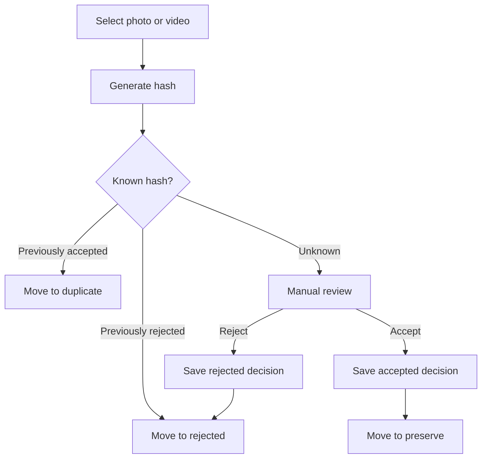

# Yaadein

Clear digital clutter and preserve the memories that matter.

## Documentation

Read these before writing application code:

| Doc | Purpose |
|-----|---------|
| [PRODUCT.md](PRODUCT.md) | Purpose, workflows, MVP scope, cloud write policy |
| [ARCHITECTURE.md](ARCHITECTURE.md) | Layers, Cosmos/Blob design, risks, diagrams |
| [ROADMAP.md](ROADMAP.md) | Desktop-first milestones |
| [AGENTS.md](AGENTS.md) | Coding rules for Cursor agents |

## Locked decisions (summary)

- **Move-on-classify** into `preserve` / `rejected` / `duplicate` under `YYYY/MM` (never auto-delete)
- **Manual cleanup** of local `rejected/` and `duplicate/` after review (decisions kept by hash)
- **Desktop-first**: local app before Azure
- Cosmos: required separate fields **`contentHash`** and **`fileSize`** (`id` may equal hash for reads, not a substitute)
- **Duplicates:** size candidates → SHA-256 confirm (size alone never proves duplication)
- **Cloud**: `ACCEPTED` → full Cosmos + Blob; `REJECTED` → lean Cosmos (no Blob); `DUPLICATE` → local only
- **Tags** (`people` / `places` / `events`) extracted during local media processing (MVP)

## Media review workflow



Implementation follows [ROADMAP.md](ROADMAP.md). Current code targets **Milestone 3** (hash, metadata, tags) on top of the working-folder shell.

## Development

Requires Node.js 20+ and [pnpm](https://pnpm.io/).

```bash
pnpm install
pnpm dev      # Electron shell with working-folder + media inspect harness
pnpm test     # unit tests
pnpm lint     # ESLint
```

Desktop app lives in `apps/desktop`.
