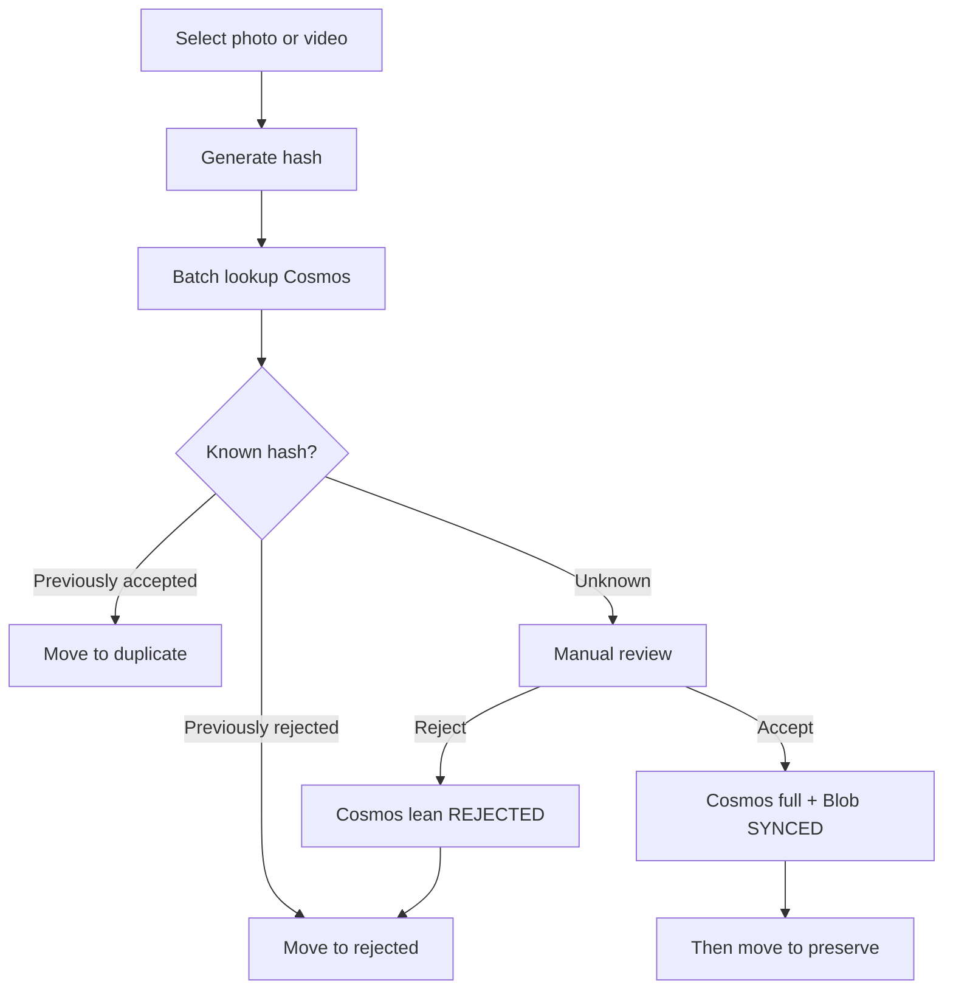

# Yaadein

Clear digital clutter and preserve the memories that matter.

## Documentation

| Doc | Purpose |
|-----|---------|
| [PRODUCT.md](PRODUCT.md) | Purpose, workflows, MVP scope |
| [ARCHITECTURE.md](ARCHITECTURE.md) | Layers, Cosms/Blob, Entra user access |
| [ROADMAP.md](ROADMAP.md) | Milestones |
| [AGENTS.md](AGENTS.md) | Agent coding rules |

## Prerequisites

### Local

- Node.js 20+ and [pnpm](https://pnpm.io)
- macOS or Windows (Electron desktop)

### Azure (required for sign-in, scan, accept/reject)

Solo MVP uses **Entra user tokens + Azure RBAC**. Do **not** put Cosms or storage **account keys** in the app.

1. **Entra ID app registration** (public client / mobile & desktop)
   - Single-tenant is fine for personal use
   - Redirect URI: `http://localhost` (public client / native)
   - No client secret
   - API permissions (delegated):
     - Azure Cosmos DB → `user_impersonation`
     - Azure Storage → `user_impersonation`
     - Microsoft Graph → `User.Read` (optional; Tools → Call Graph `/me`)
   - Copy **Application (client) ID** and **Directory (tenant) ID** into `.env`

2. **Azure Cosmos DB** (NoSQL)
   - Account endpoint URL only (no keys)
   - Database `yaadein`, container `media`, partition key `/userId`
   - Grant the signed-in user (or a group) a data-plane role such as **Cosmos DB Built-in Data Contributor** on the account or database

3. **Azure Blob Storage**
   - Account URL like `https://<account>.blob.core.windows.net` (no keys)
   - Container `media` (create if missing)
   - Grant the signed-in user **Storage Blob Data Contributor** on the account or container

4. **App config**
   - Copy `apps/desktop/.env.example` → `apps/desktop/.env` and fill the public IDs/endpoints
   - Optional overrides: `YAADEIN_COSMOS_SCOPE`, `YAADEIN_BLOB_SCOPE` (defaults are the `user_impersonation` scopes above)

Without sign-in + these RBAC assignments, classify/accept/reject fail closed (by design).

## Locked decisions (summary)

- **Cosmos** is the decision store — **no local SQL decision cache**
- **Solo MVP:** desktop uses **Entra user token + Azure RBAC** for Cosms/Blob — **no Functions**, **no account keys in the app**
- **Accept:** Cosms + Blob `SYNCED` → **then** `preserve/`
- **Reject:** Cosms lean → `rejected/`
- **Duplicate:** local only (accepted hash already in Cosms)
- Cosms fields: separate **`contentHash`** and **`fileSize`**; partition `/userId`
- Classify/accept/reject require **sign-in + network**

## Media review workflow



Implementation follows [ROADMAP.md](ROADMAP.md). **MVP milestones M1–M12 complete.** Next: **product UX M13–M18** (packaging, home shell, Tinder review, rejected/duplicate libraries, cherish + tags). Set `apps/desktop/.env` from `.env.example` (Entra IDs + Cosms + Blob endpoints).

## Development

```bash
pnpm install
pnpm dev          # run Electron app (loads apps/desktop/.env at runtime)
pnpm test
pnpm lint
```

Desktop app: `apps/desktop`. See **Prerequisites** above, then copy `apps/desktop/.env.example` → `apps/desktop/.env` and fill Entra IDs + Cosms/Blob endpoints (public client config only — never account keys).

## Create Mac / Windows executables

Public Entra/Cosmos/Blob values from `apps/desktop/.env` are **embedded at build time**. The installed app needs no manual `.env` copy.

```bash
# once: ensure apps/desktop/.env is filled (required keys must be non-empty)
pnpm dist:mac    # → apps/desktop/release/Yaadein-Mac-*.dmg and *.zip (arm64 + x64)
pnpm dist:win    # → apps/desktop/release/Yaadein-Windows-*-x64.zip
pnpm dist        # mac + win targets
```

Also available: `pnpm --filter @yaadein/desktop dist:dir` (unpacked app only, faster smoke).

Builds are unsigned local packages (no notarization / auto-update). Do not embed Cosms or storage **account keys**.

Working folder and scan root are saved in app userData as `desktop-settings.json` and restored on the next launch (Mac and Windows):

- macOS: `~/Library/Application Support/Yaadein/desktop-settings.json`
- Windows: `%APPDATA%\Yaadein\desktop-settings.json` (typically `C:\Users\<you>\AppData\Roaming\Yaadein\`)

Rebuild with `pnpm dist:mac` / `pnpm dist:win` after pulling so packaged apps include this behavior.
