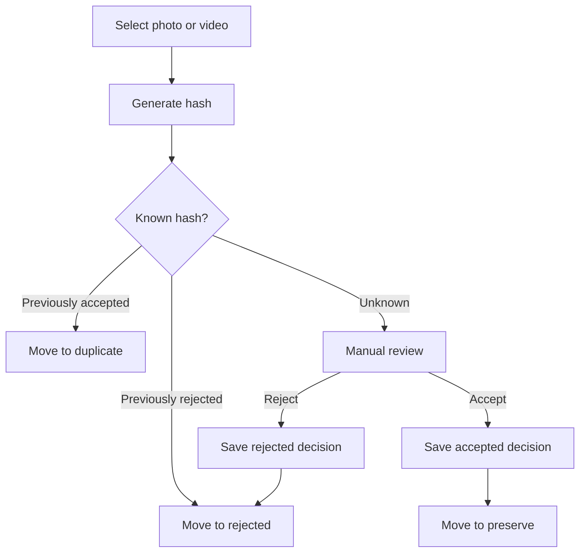

# Yaadein

Clear digital clutter and preserve the memories that matter.

## Documentation

Read these before writing application code:

| Doc | Purpose |
|-----|---------|
| [PRODUCT.md](PRODUCT.md) | Purpose, workflows, MVP scope, cloud write policy |
| [ARCHITECTURE.md](ARCHITECTURE.md) | Layers, Cosmos/Blob design, risks, diagrams |
| [ROADMAP.md](ROADMAP.md) | 12 desktop-first milestones |
| [AGENTS.md](AGENTS.md) | Coding rules for Cursor agents |

## Locked decisions (summary)

- **Move-on-classify** into `preserve` / `rejected` / `duplicate` under `YYYY/MM` (never auto-delete)
- **Desktop-first**: local app before Azure
- Cosmos **`id` = SHA-256** content hash
- **Cloud**: `ACCEPTED` → full Cosmos + Blob; `REJECTED` → lean Cosmos (no Blob); `DUPLICATE` → local only
- **Tags** (`people` / `places` / `events`) extracted during local media processing (MVP)

## Media review workflow

Implementation starts at **Milestone 1** in [ROADMAP.md](ROADMAP.md).
