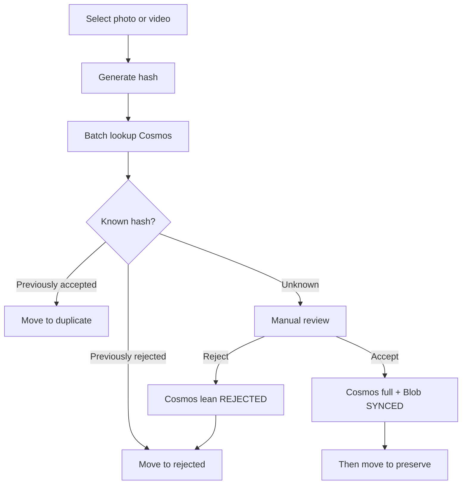

# Yaadein

Clear digital clutter and preserve the memories that matter.

## Documentation

| Doc | Purpose |
|-----|---------|
| [PRODUCT.md](PRODUCT.md) | Purpose, workflows, MVP scope |
| [ARCHITECTURE.md](ARCHITECTURE.md) | Layers, Cosms/Blob, Entra user access |
| [ROADMAP.md](ROADMAP.md) | Milestones |
| [AGENTS.md](AGENTS.md) | Agent coding rules |

## Locked decisions (summary)

- **Cosmos** is the decision store — **no local SQL decision cache**
- **Solo MVP:** desktop uses **Entra user token + Azure RBAC** for Cosms/Blob — **no Functions**, **no account keys in the app**
- **Accept:** Cosms + Blob `SYNCED` → **then** `preserve/`
- **Reject:** Cosms lean → `rejected/`
- **Duplicate:** local only (accepted hash already in Cosms)
- Cosms fields: separate **`contentHash`** and **`fileSize`**; partition `/userId`
- Classify/accept/reject require **sign-in + network**

## Media review workflow



Implementation follows [ROADMAP.md](ROADMAP.md). **Next: Milestone 6 — Blob via Entra user.** Set `apps/desktop/.env` from `.env.example` (Entra IDs + Cosms endpoint).

## Development

```bash
pnpm install
pnpm dev
pnpm test
pnpm lint
```

Desktop app: `apps/desktop`.
