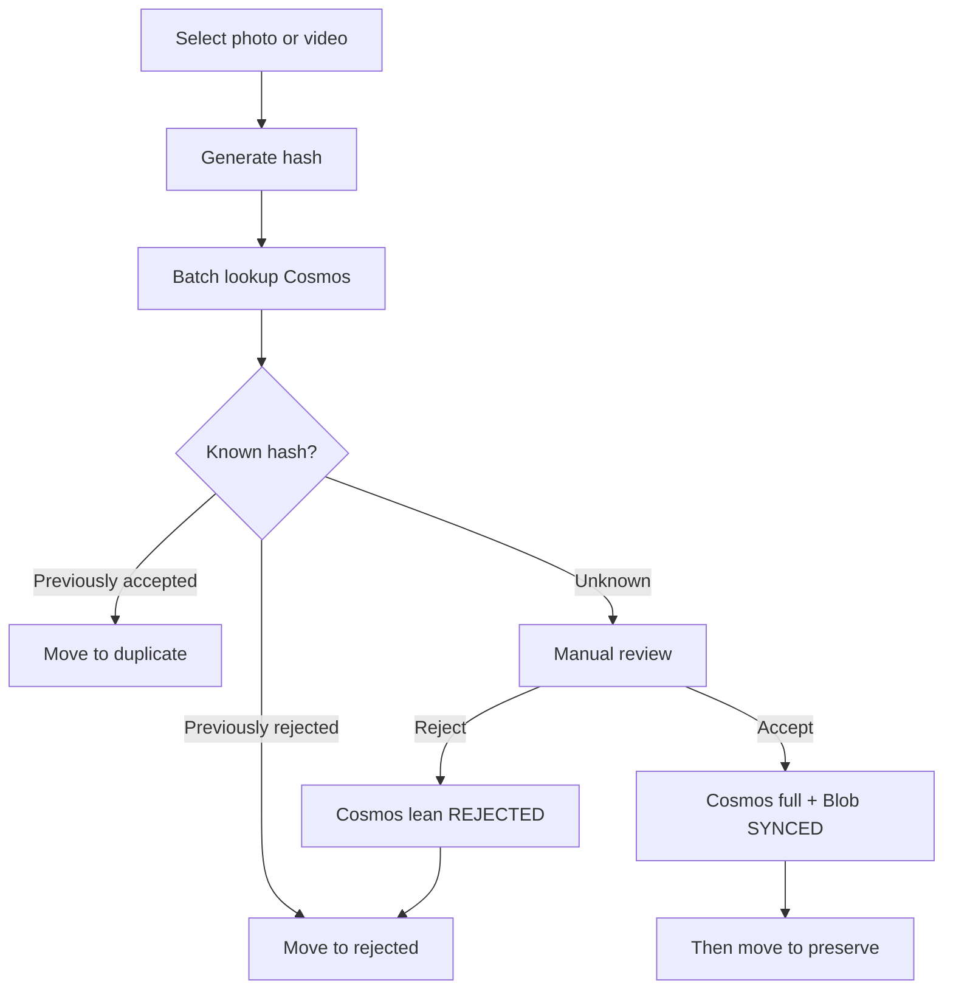

# Yaadein

Clear digital clutter and preserve the memories that matter.

## Documentation

Read these before writing application code:

| Doc | Purpose |
|-----|---------|
| [PRODUCT.md](PRODUCT.md) | Purpose, workflows, MVP scope, cloud write policy |
| [ARCHITECTURE.md](ARCHITECTURE.md) | Layers, Cosms/Blob design, risks, diagrams |
| [ROADMAP.md](ROADMAP.md) | Cloud-backed desktop milestones |
| [AGENTS.md](AGENTS.md) | Coding rules for Cursor agents |

## Locked decisions (summary)

- **Cosmos is the decision store** (via Functions) — **no local SQL decision cache**
- **Accept:** Cosms + Blob `SYNCED` → **then** move to `preserve/`
- **Reject:** Cosms lean → move to `rejected/`
- **Duplicate:** Cosms accepted hit → move to `duplicate/` (no new Cosms doc)
- Manual cleanup of local `rejected/` / `duplicate/` after review (Cosms decisions kept)
- Cosms docs: required separate fields **`contentHash`** and **`fileSize`**
- **Duplicates:** size candidates → SHA-256 confirm (size alone never proves duplication)
- **Tags** (`people` / `places` / `events`) extracted during local media processing
- MVP classify/accept/reject requires **sign-in + network**

## Media review workflow



Implementation follows [ROADMAP.md](ROADMAP.md). Milestones 1–3 are done (shell, working folder, hash/metadata/tags). **Next: Milestone 4 — Auth.**

The earlier local-SQLite / move-before-upload plan is **superseded** (see ROADMAP). Close or ignore the `cursor/m4-sqlite-cache` branch.

## Development

Requires Node.js 20+ and [pnpm](https://pnpm.io/).

```bash
pnpm install
pnpm dev      # Electron shell with working-folder + media inspect harness
pnpm test     # unit tests
pnpm lint     # ESLint
```

Desktop app lives in `apps/desktop`.
