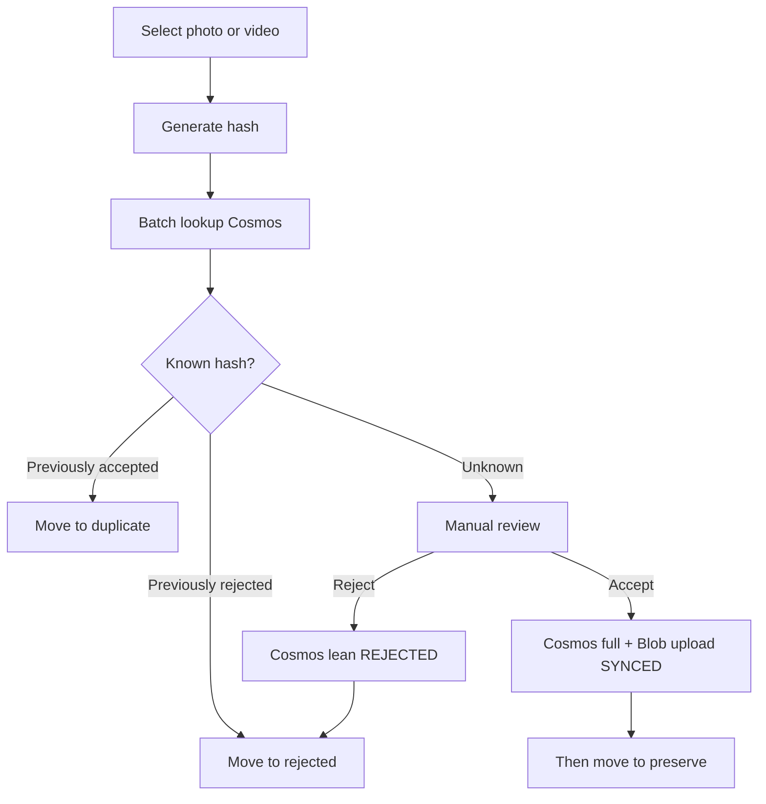
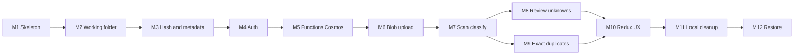

# ROADMAP.md

## Principles

- One clear goal per milestone
- Independently testable
- Do **not** implement future milestones early
- Each milestone leaves the product in a working incremental state
- **Cloud-backed desktop:** auth + Cosmos + Blob come before scan/classify/accept that depends on them
- **No local SQL decision cache** — Cosmos (via Functions) is the decision store
- After each milestone: add/update tests and run them

Agents must read [AGENTS.md](AGENTS.md) and the current milestone only before coding.

## Media review workflow (product picture)

**Move rules:**

- **REJECTED** / **DUPLICATE** — move into the working folder after the decision is confirmed (Cosmos lean write for reject; Cosmos accepted hit for duplicate).
- **ACCEPTED** — write Cosmos + upload Blob to `SYNCED`, **then** move into `preserve/`. Do not move accepted bytes into `preserve/` before cloud upload succeeds.

---

## Milestone 1 — Tooling skeleton

**Goal:** Runnable Electron + React + TypeScript shell with lint/test harness.

**Status:** Done.

**In scope:** `apps/desktop` scaffold, TypeScript, pnpm, lint + Vitest smoke, empty UI shell.

**Working state:** App launches to a shell window.

---

## Milestone 2 — Working folder and safe moves

**Goal:** Create the Yaadein working tree and move files into `preserve` / `duplicate` / `rejected` under `YYYY/MM`.

**Status:** Done.

**In scope:** Configurable working root; ensure buckets; safe same/cross-volume move; collision disambiguation; organize-date override support.

**Working state:** Harness/IPC can move a sample file into the correct folder.

---

## Milestone 3 — Content hash, metadata, size, and tags

**Goal:** Compute SHA-256 and file size; extract capture date (filesystem fallback); extract MVP tags.

**Status:** Done.

**In scope:** SHA-256 + `fileSize`; EXIF date; oldest usable FS timestamp fallback; media type / dimensions / duration best-effort; `tags.people|places|events`.

**Out of scope:** Classification, Cosmos, SQLite decision cache.

**Working state:** IPC returns hash + size + metadata + tags for a selected file.

---

## Milestone 4 — Auth (Entra External ID + PKCE)

**Goal:** Sign in from Electron; obtain API access tokens without client secrets.

**In scope:**

- Entra External ID app registration config (client ID, authority) as non-secret config
- OAuth Authorization Code + PKCE suitable for Electron
- Secure-enough token storage on main side
- Authenticated HTTP helper calling a health or `me` endpoint (mockable)

**Out of scope:** Cosmos, Blob, decision APIs beyond stub.

**Expected tests:** PKCE helper unit tests; API client attaches bearer token (mocked HTTP).

**Working state:** User can sign in/out; app can call a protected stub.

---

## Milestone 5 — Azure Functions + Cosmos decisions

**Goal:** Authenticated API batch-looks-up and upserts **accepted** (full) and **rejected** (lean) documents in Cosmos. Desktop talks only to Functions—not Cosmos SDKs.

**In scope:**

- `apps/api` Azure Functions project
- Validate JWT; Managed Identity to Cosmos
- Batch lookup by hashes; batch upsert accepted (full meta + tags) and rejected (lean)
- Cosmos: partition `/userId`; required separate `contentHash` + `fileSize`; `id` may equal `contentHash` for point reads only
- Reject creating cloud documents for `DUPLICATE`
- Desktop `CloudApiClient` for batch lookup/upsert

**Out of scope:** Blob upload/download; local SQLite decision cache; scan orchestration.

**Expected tests:** Function handlers with mocked Cosmos; client batch marshalling; duplicate upserts rejected by API.

**Working state:** Accepted and rejected decisions persist in Cosmos and round-trip via the API.

---

## Milestone 6 — Blob upload for accepted media

**Goal:** Upload accepted bytes directly to Blob with short-lived scoped grants; track `cloudStatus` through `SYNCED`.

**In scope:**

- Function issues scoped upload grant for `ACCEPTED` items only
- Electron uploads directly to Blob (bytes never through Functions)
- Status: `NOT_REQUIRED` / `PENDING` / `UPLOADING` / `SYNCED` / `FAILED`
- Retry with fresh grant on expiry/failure
- Domain rule: **do not** move into `preserve/` until `cloudStatus === SYNCED` (wired in Milestone 8; this milestone delivers the upload pipeline)

**Out of scope:** Full restore UX; moving into preserve (next milestones use this pipeline).

**Expected tests:** Grant authZ tests; upload queue retries with mocked blob; status transitions.

**Working state:** A selected accepted file can reach `SYNCED` in Blob + Cosmos without requiring the preserve move yet (dev harness OK).

---

## Milestone 7 — Scan and classify known hashes (Cosmos)

**Goal:** Scan folders, hash files, **batch-lookup Cosmos**, auto-move known decisions, skip unknowns.

**In scope:**

- Folder picker / selected roots; walk media
- Batch Cosmos lookup via Functions
- Auto-move **previously rejected** → `rejected/`; **previously accepted** → `duplicate/`
- Leave `UNKNOWN` in place (no move)
- Require signed-in session + connectivity for classify
- Scan progress events to UI or logs

**Out of scope:** Review UI for unknowns; Blob upload during scan; inventing duplicate detection beyond “hash matches accepted in Cosmos.”

**Expected tests:** Fixture tree with mocked Cosmos responses; assert moves to `rejected/` vs `duplicate/` and skips for unknown; offline/unauthenticated scan fails closed.

**Working state:** User signs in, scans a folder, and known files organize from Cosmos decisions.

---

## Milestone 8 — Review unknowns (accept after cloud)

**Goal:** Explicit UI to accept or reject unknown media with Cosms-first accept path.

**In scope:**

- Queue of `UNKNOWN` items from last scan or on demand
- Preview (path + metadata + tags; thumbnail if easy)
- **Reject** → Cosmos lean upsert → move to `rejected/`
- **Accept** → Cosmos full upsert → Blob upload to `SYNCED` → **then** move to `preserve/`
- On accept upload failure: leave source file unmoved; surface `FAILED` / retry; do not place into `preserve/`
- Prefer batch where practical for rejects; accepts may be one-at-a-time in MVP UI

**Out of scope:** Restore; rich tag-edit product UI; offline accept queue (MVP requires online accept).

**Expected tests:** Domain tests for accept/reject ordering (no preserve move before `SYNCED`); IPC/component tests as practical.

**Working state:** End-to-end cloud-backed loop: known hashes auto-organize; unknowns reviewed with accept-after-upload.

---

## Milestone 9 — Exact duplicate detection

**Goal:** During scan, recognize exact duplicates via size then hash against Cosmos accepted (and within-batch peers).

**In scope:**

- Same **file size** candidates → compare **SHA-256** → duplicate **only if hashes match**
- Never treat size-only matches as duplicates
- Hash matches an **ACCEPTED** Cosmos document → `DUPLICATE` move to `duplicate/` (no new Cosmos row)
- Within-scan batch grouping by size then hash
- Flag hash match with mismatched stored `fileSize` as anomalous

**Out of scope:** Near-duplicate / perceptual hash; writing duplicate documents to Cosmos.

**Expected tests:** Identical fixtures → one accept path / one duplicate; same-size different-bytes → not duplicate; no Cosmos write for the duplicate.

**Working state:** Re-importing the same bytes yields duplicates, not second accepts.

---

## Milestone 10 — Redux UX: progress, queues, settings

**Goal:** Polished UX state for progress, review queues, auth presentation, and settings.

**In scope:**

- Redux Toolkit slices for UI session, scan/upload progress, review queue presentation, settings
- Persist working folder path and selected roots (via main)
- Clear progress / error surfaces for scan, Cosms calls, and uploads

**Out of scope:** Full library browser product polish beyond what review needs.

**Expected tests:** Reducer/selector tests; settings round-trip.

**Working state:** Cloud-backed desktop feels usable day to day.

---

## Milestone 11 — Local cleanup of rejected and duplicates

**Goal:** User-initiated delete of local junk under `rejected/` and `duplicate/` after confirmation.

**In scope:**

- Cleanup: all rejected, all duplicates, by year/month, or selected
- Confirmation required; never delete `preserve/` or Blob objects via this flow
- **Retain** Cosms accepted/rejected decisions so future scans still classify
- Progress/errors for bulk cleanup

**Out of scope:** Auto-cleanup on scan/review; OS Recycle Bin integration (optional later).

**Expected tests:** Temp-dir fixtures; after cleanup files gone, Cosms lookups still return decisions; preserve untouched.

**Working state:** User can free space after review without losing cloud decision memory.

---

## Milestone 12 — Download, restore, and preserve rebuild

**Goal:** Download accepted media with hash verify; restore into `preserve/YYYY/MM`.

**In scope:**

- Download grants from Functions; direct Blob download
- Hash verification; skip if local hash already matches
- Retries; local availability states
- Rebuild `preserve` on a new computer from Cosms metadata + blobs

**Out of scope:** Restoring to original pre-scan paths; mobile; perceptual hash; multi-cloud.

**Expected tests:** Path placement, skip-if-present, verify-fail paths; filtered restore by year/month.

**Working state:** MVP complete for desktop preserve/restore loop.

---

## Explicitly postponed (after MVP)

- Local SQLite (or other) **decision** cache / offline decision catalog
- Offline accept/reject queues that later flush to Cosms
- Perceptual / near-duplicate detection
- Mobile client
- Multi-user / family sharing
- Automatic permanent deletion during scan/review
- Bidirectional sync / CRDTs
- Non-Azure providers
- Heavy IaC/CI beyond what a milestone needs to ship

## Milestone dependency overview

## Superseded approach

Earlier drafts used a **local SQLite decision cache** and **move-on-classify into `preserve/` before cloud upload**, with Azure late in the roadmap. That approach is **superseded**. Do not implement SQLite as the decision store. Do not move accepted files into `preserve/` before Blob `SYNCED`.
