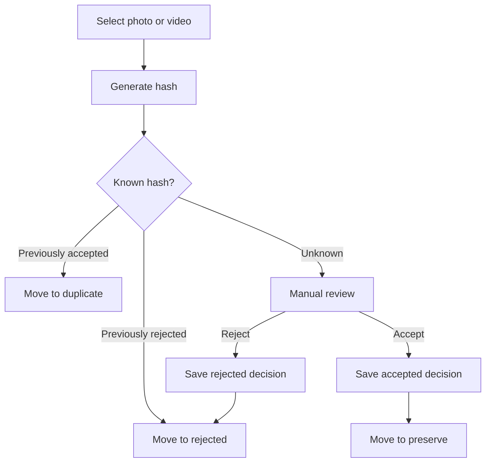
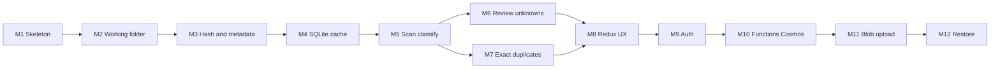

# ROADMAP.md

## Principles

- One clear goal per milestone
- Independently testable
- Do **not** implement future milestones early
- Each milestone leaves the product in a working incremental state
- Desktop-first: local Electron value before Azure
- After each milestone: add/update tests and run them

Agents must read [AGENTS.md](AGENTS.md) and the current milestone only before coding.

## Media review workflow (product picture)

All scan/review milestones implement this mental model (see also [PRODUCT.md](PRODUCT.md) / [ARCHITECTURE.md](ARCHITECTURE.md)):

**Cloud (from Milestone 10+):** accepted → full Cosmos + Blob; rejected → lean Cosmos; duplicate → no new Cosmos row.

---

## Milestone 1 — Tooling skeleton

**Goal:** Runnable Electron + React + TypeScript shell with lint/test harness.

**In scope:**

- `apps/desktop` scaffold (Electron main + React renderer)
- TypeScript, pnpm workspace root as needed
- Minimal lint + unit test runner smoke test
- Empty UI shell (“Yaadein”)

**Out of scope:** Scanning, hashing, cloud, working folders.

**Expected tests:** Smoke test that a pure TS module or app bootstrap helper runs under the test runner.

**Working state:** App launches to a blank/shell window.

---

## Milestone 2 — Working folder and safe moves

**Goal:** Create the Yaadein working tree and move files into `preserve` / `duplicate` / `rejected` under `YYYY/MM`.

**In scope:**

- Configurable working root
- Ensure `preserve`, `duplicate`, `rejected`
- Destination path from a provided capture date (or injected date for tests)
- Same-volume and cross-volume safe move with post-move existence checks
- Filename collision disambiguation

**Out of scope:** Real EXIF, hashing, UI review, cloud.

**Expected tests:** Unit/integration tests for path computation, collision rename, and move behavior (temp dirs).

**Working state:** Dev/test harness or minimal IPC can move a sample file into the correct folder.

---

## Milestone 3 — Content hash, metadata, and tags

**Goal:** Compute SHA-256; extract capture date (with filesystem fallback); extract MVP tags during the same processing pass.

**In scope:**

- SHA-256 of full file bytes
- Photo EXIF capture date where available
- Fallback: `mtime` then `ctime`
- Basic media type / size; best-effort width/height/duration where easy
- Tag extraction into `tags.people`, `tags.places`, `tags.events` from embedded metadata / GPS / related fields (empty arrays when unknown)

**Out of scope:** Classification, SQLite, cloud, perceptual hash, ML face recognition/clustering, reverse-geocode network services beyond what can be done simply from already-present location strings (GPS→place name can be a thin best-effort later within this milestone only if kept simple and tested).

**Expected tests:** Known fixture files → stable hash; missing EXIF → fallback date; date feeds Milestone 2 path helper; fixtures with/without tag metadata → expected `tags` shape.

**Working state:** CLI or IPC returns hash + metadata + tags for a selected file.

---

## Milestone 4 — Local SQLite cache

**Goal:** Persist hash → decision and supporting fields in a rebuildable local cache.

**In scope:**

- SQLite schema for media cache rows (hash, decision, paths, timestamps, basic metadata, tags JSON)
- Upsert / get-by-hash / batch-get-by-hashes
- App-local DB path under user data

**Out of scope:** Cloud sync, scan orchestration, Redux polish.

**Expected tests:** Batch get/upsert including tags; restart process still sees rows (integration with temp DB).

**Working state:** Decisions can be written and read back without UI.

---

## Milestone 5 — Scan and classify known hashes

**Goal:** Scan selected folders, hash files, batch-lookup cache, auto-move known decisions, skip unknowns.

**In scope:**

- Folder picker / selected roots
- Walk media files
- Batch cache lookup
- Auto-move **previously rejected** → `rejected/`; **previously accepted** → `duplicate/`
- Leave `UNKNOWN` / missing in place (no move)
- Basic scan progress events to UI or logs

**Out of scope:** Review UI for unknowns, cloud lookup, inventing new duplicate detection beyond applying a known accepted hash as duplicate.

**Expected tests:** Fixture tree with pre-seeded rejected and accepted hashes; assert moves to `rejected/` vs `duplicate/` and skips for unknown.

**Working state:** User can scan a folder and known files organize themselves.

---

## Milestone 6 — Review unknowns

**Goal:** Explicit UI to accept or reject unknown media (moves + cache update).

**In scope:**

- Queue of `UNKNOWN` items from last scan or on demand
- Preview enough to decide (thumbnail or path + metadata + extracted tags)
- Accept → save decision + move to `preserve/`; Reject → save decision + move to `rejected/`
- Persist decision in SQLite

**Out of scope:** Cloud upload, restore, full tag-edit/search product UI.

**Expected tests:** Domain tests for decision application; component or IPC tests as practical.

**Working state:** End-to-end local loop matching the media review workflow diagram: known hashes auto-organize; unknowns reviewed manually.

---

## Milestone 7 — Exact duplicate detection

**Goal:** During scan, recognize exact content-hash duplicates and move them to `duplicate/`.

**In scope:**

- If hash matches an existing `ACCEPTED` record (local cache and, when online, Cosmos accepted lookup), classify new file as `DUPLICATE` with local `duplicateOf`
- Also detect duplicates within the same scan batch
- Move to `duplicate/YYYY/MM` and record decision **locally only** (no Cosmos document for the duplicate)

**Out of scope:** Near-duplicate / perceptual hash; writing duplicate rows to cloud.

**Expected tests:** Two identical fixtures; one preserved path, one duplicate path; local `duplicateOf` set; no cloud write attempted for the duplicate.

**Working state:** Re-importing the same bytes yields duplicates, not second accepts.

---

## Milestone 8 — Redux UX: progress, queues, settings

**Goal:** Polished local UX state for progress, review queues, and settings.

**In scope:**

- Redux Toolkit slices for UI session, scan progress, review queue presentation, settings
- Persist working folder path and selected roots (via main)
- Clear progress / error surfaces for scan and moves

**Out of scope:** Auth UI beyond placeholder, cloud status views.

**Expected tests:** Reducer/selector tests; settings round-trip.

**Working state:** Local product feels usable without cloud.

---

## Milestone 9 — Auth (Entra External ID + PKCE)

**Goal:** Sign in from Electron; obtain API access tokens without client secrets.

**In scope:**

- Entra External ID app registration config (client ID, authority) as non-secret config
- OAuth Authorization Code + PKCE flow suitable for Electron
- Secure-enough token storage on main side
- Authenticated HTTP helper stub calling a health or `me` endpoint (mockable)

**Out of scope:** Cosmos, Blob, real decision APIs (stub/mock server acceptable).

**Expected tests:** PKCE helper unit tests; API client attaches bearer token (mocked HTTP).

**Working state:** User can sign in/out; app can call a protected stub.

---

## Milestone 10 — Azure Functions + Cosmos (accepted + rejected)

**Goal:** Authenticated API persists and returns **accepted** (full) and **rejected** (lean) documents in batches; local cache refreshes from cloud.

**In scope:**

- `apps/api` Azure Functions project
- Validate JWT
- Managed Identity to Cosmos
- Batch lookup by hashes; batch upsert **accepted** metadata/tags and **rejected** lean decision docs
- Cosmos documents: partition `/userId`, `id` = SHA-256 content hash (id is the hash; no separate `contentHash` field)
- Do not create cloud documents for `DUPLICATE`
- Desktop `CloudApiClient` integration; flush offline accepted/rejected queue
- Local accepted/rejected cache treated as non-authoritative after sync

**Out of scope:** Blob upload/download, SAS; storing duplicate rows in Cosmos.

**Expected tests:** Function handler tests with mocked Cosmos (accepted tags round-trip; rejected lean upsert; duplicate upserts rejected); client batch marshalling tests.

**Working state:** Accepted and rejected decisions survive across machines via Cosmos (accepted bytes still local until Milestone 11). Duplicates remain a local classification against accepted hashes.

---

## Milestone 11 — Blob upload for accepted media

**Goal:** Upload accepted media directly to Blob using short-lived scoped access; track `cloudStatus`.

**In scope:**

- Function issues scoped upload grant for `ACCEPTED` items
- Electron uploads directly to Blob
- Status lifecycle: `NOT_REQUIRED` / `PENDING` / `UPLOADING` / `SYNCED` / `FAILED`
- Retry with fresh grant on expiry/failure
- Do not send file bytes through Functions

**Out of scope:** Full restore UX (download grants may be minimal/internal only).

**Expected tests:** Grant handler authZ tests; upload queue retry tests with mocked blob; status transitions.

**Working state:** Accepted local files can reach `SYNCED` in cloud storage.

---

## Milestone 12 — Download, restore, and preserve rebuild

**Goal:** Download accepted media with hash verify; support single, selection, year/month, and full restore into `preserve/YYYY/MM`.

**In scope:**

- Download grants from Functions
- Direct Blob download
- Hash verification; skip if local hash already matches
- Retries; `DOWNLOAD_*` local availability states
- Rebuild `preserve` on a new computer from cloud metadata + blobs

**Out of scope:** Restoring to original pre-scan paths; mobile client; perceptual hash; multi-cloud.

**Expected tests:** Path placement, skip-if-present, verify-fail → retry/fail states; filtered restore by year/month.

**Working state:** MVP complete for desktop preserve/restore loop.

---

## Explicitly postponed (after MVP)

- Perceptual / near-duplicate detection
- Mobile client
- Multi-user / family sharing
- Permanent deletion tools
- Bidirectional sync / CRDTs
- Non-Azure providers
- Heavy IaC/CI beyond what a milestone needs to ship

## Milestone dependency overview

