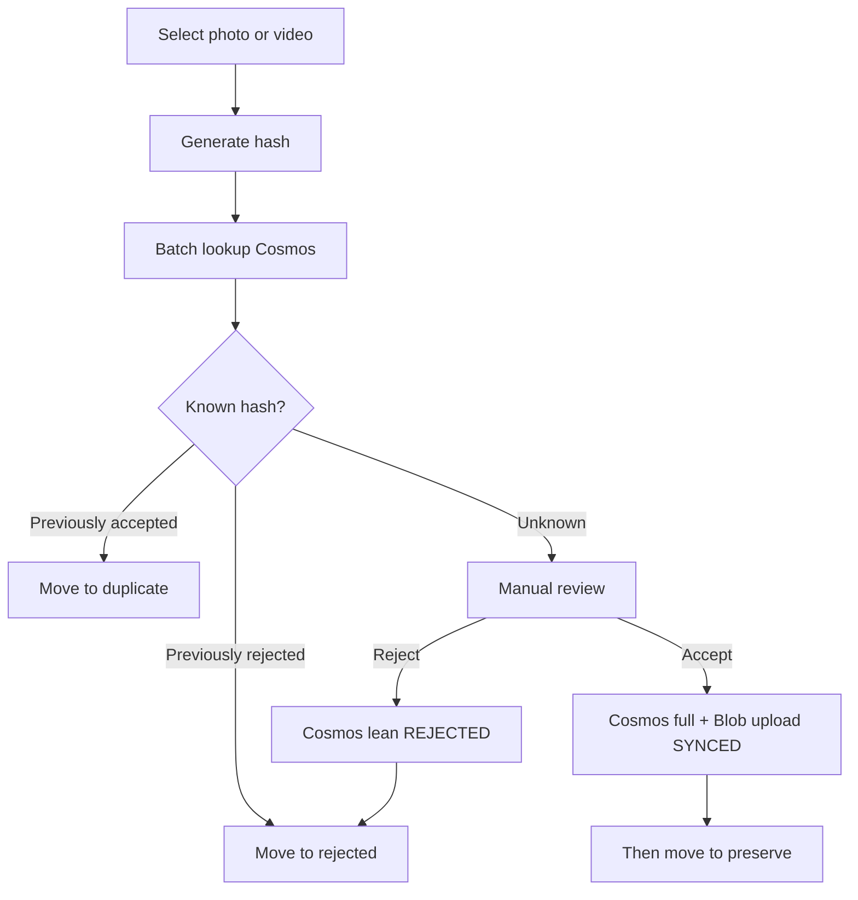
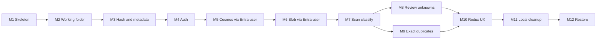

# ROADMAP.md

## Principles

- One clear goal per milestone
- Independently testable
- Do **not** implement future milestones early
- Each milestone leaves the product in a working incremental state
- **Cloud-backed desktop (solo MVP):** Entra user sign-in; desktop talks to **Cosmos** and **Blob** with the **user access token** (Azure RBAC)—**no** Azure Functions and **no** account keys in the app
- **No local SQL decision cache** — Cosmos is the decision store
- After each milestone: add/update tests and run them

Agents must read [AGENTS.md](AGENTS.md) and the current milestone only before coding.

## Media review workflow (product picture)

**Move rules:**

- **REJECTED** / **DUPLICATE** — move after decision confirmed in Cosms (lean write / accepted hit).
- **ACCEPTED** — Cosms + Blob `SYNCED`, **then** move to `preserve/`.

---

## Milestone 1 — Tooling skeleton

**Status:** Done.

---

## Milestone 2 — Working folder and safe moves

**Status:** Done.

---

## Milestone 3 — Content hash, metadata, size, and tags

**Status:** Done.

---

## Milestone 4 — Auth (Entra ID + PKCE)

**Goal:** Sign in from Electron; obtain access tokens without client secrets.

**Status:** Done.

**In scope (delivered):** Single-tenant Entra public client, PKCE/MSAL, main-process token cache, Graph `/me` stub, IDs in gitignored `.env`.

---

## Milestone 5 — Cosmos decisions via Entra user

**Goal:** Desktop batch-looks-up and upserts **accepted** (full) and **rejected** (lean) documents in Cosms using the **signed-in user’s** Azure AD token.

**In scope:**

- Cosms NoSQL account + database `yaadein` + container `media` (partition `/userId`) — may already exist
- Azure RBAC: signed-in user (or security group) has Cosms **data-plane** access (e.g. Built-in Data Contributor)
- Desktop Cosms adapter (SDK) behind a small repository/API boundary; acquire token for Cosms resource scope
- Batch lookup by hashes; batch upsert accepted (full meta + tags) and rejected (lean)
- Required fields `contentHash` + `fileSize`; `id` may equal `contentHash`
- Reject writing `DUPLICATE` documents
- Dev harness: after sign-in, upsert/lookup a sample decision doc
- Expand MSAL scopes as needed for Cosms (keep Graph optional)

**Out of scope:** Azure Functions; Blob upload; scan orchestration; account keys in the app or encrypted key files.

**Expected tests:** Repository/mapper unit tests with mocked Cosms client; duplicate upsert rejected; partition key = user oid.

**Working state:** Signed-in user can persist and read accepted/rejected decisions in Cosms from the desktop app.

---

## Milestone 6 — Blob upload via Entra user

**Goal:** Upload accepted bytes to Blob with the user token; track `cloudStatus` through `SYNCED`.

**In scope:**

- Storage account + container for accepted media
- Azure RBAC: user has **Storage Blob Data Contributor** (or tighter equivalent)
- Desktop upload via Blob SDK + user token
- Status: `NOT_REQUIRED` / `PENDING` / `UPLOADING` / `SYNCED` / `FAILED`
- Update Cosms `cloudStatus` / `cloudObjectId` after success
- Do not move into `preserve/` until `SYNCED` (wired in review milestone)

**Out of scope:** Functions/SAS broker; full restore UX.

**Expected tests:** Upload queue/status transitions with mocked Blob; failure leaves source unmoved when accept pipeline is wired.

**Working state:** A selected accepted file can reach `SYNCED` in Blob + Cosms from the desktop app.

---

## Milestone 7 — Scan and classify known hashes (Cosmos)

**Goal:** Scan folders, hash files, batch-lookup Cosms, auto-move known decisions, skip unknowns.

**In scope:** Folder roots; walk media; batch Cosms lookup; rejected → `rejected/`; accepted → `duplicate/`; skip unknown; require sign-in + network; progress events.

**Out of scope:** Review UI; Blob during scan.

**Expected tests:** Fixture tree + mocked Cosms; offline/unauthenticated fails closed.

**Working state:** Signed-in scan organizes known files from Cosms decisions.

---

## Milestone 8 — Review unknowns (accept after cloud)

**Goal:** Accept/reject unknowns with Cosms-first accept path.

**In scope:**

- Review queue + preview
- Reject → Cosms lean → move `rejected/`
- Accept → Cosms full → Blob `SYNCED` → **then** move `preserve/`
- Upload failure: source unmoved; retry

**Out of scope:** Offline accept queues; rich tag-edit product UI.

**Expected tests:** Ordering tests (no preserve move before `SYNCED`).

**Working state:** End-to-end solo cloud-backed loop.

---

## Milestone 9 — Exact duplicate detection

**Goal:** Size candidates → SHA-256; duplicate only on hash match vs Cosms accepted / in-batch peers; move to `duplicate/`; no Cosms duplicate doc.

---

## Milestone 10 — Redux UX: progress, queues, settings

**Goal:** Polished UI state for progress, review queues, auth, settings.

---

## Milestone 11 — Local cleanup of rejected and duplicates

**Goal:** User-confirmed delete under `rejected/` / `duplicate/`; retain Cosms decisions.

---

## Milestone 12 — Download, restore, and preserve rebuild

**Goal:** Download accepted media with user token; hash verify; rebuild `preserve/YYYY/MM`.

---

## Explicitly postponed (after MVP)

- Azure Functions / API broker (reintroduce if multi-user or untrusted clients)
- Local SQL decision cache / offline decision catalog
- Encrypted Cosms/storage **account keys** in the desktop app
- Perceptual near-duplicates; mobile; multi-user sharing
- Automatic permanent deletion during scan/review

## Milestone dependency overview

## Superseded approaches

- Local SQLite decision cache and move-to-`preserve/` before cloud upload
- Azure Functions as required MVP gateway to Cosms/Blob
- Storing Cosms/storage account keys in the Electron app (encrypted file or otherwise)
