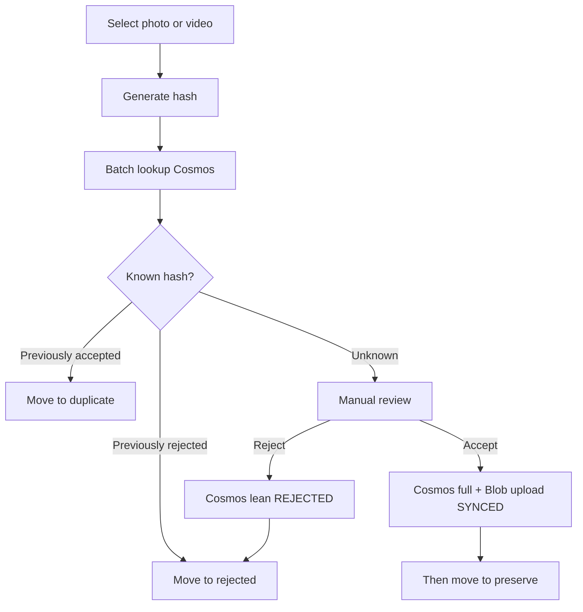
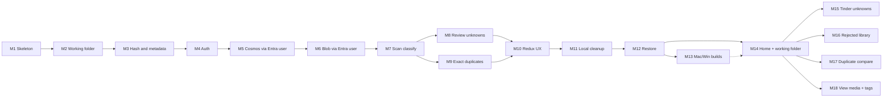

# ROADMAP.md

## Principles

- One clear goal per milestone
- Independently testable
- Do **not** implement future milestones early
- Each milestone leaves the product in a working incremental state
- **Cloud-backed desktop (solo MVP):** Entra user sign-in; desktop talks to **Cosmos** and **Blob** with the **user access token** (Azure RBAC)—**no** Azure Functions and **no** account keys in the app
- **No local SQL decision cache** — Cosmos is the decision store
- After each milestone: add/update tests and run them

Agents must read [AGENTS.md](AGENTS.md) and the current milestone only before coding.

## Media review workflow (product picture)

**Move rules:**

- **REJECTED** / **DUPLICATE** — move after decision confirmed in Cosms (lean write / accepted hit).
- **ACCEPTED** — Cosms + Blob `SYNCED`, **then** move to `preserve/`.

---

## Milestone 1 — Tooling skeleton

**Status:** Done.

---

## Milestone 2 — Working folder and safe moves

**Status:** Done.

---

## Milestone 3 — Content hash, metadata, size, and tags

**Status:** Done.

---

## Milestone 4 — Auth (Entra ID + PKCE)

**Goal:** Sign in from Electron; obtain access tokens without client secrets.

**Status:** Done.

**In scope (delivered):** Single-tenant Entra public client, PKCE/MSAL, main-process token cache, Graph `/me` stub, IDs in gitignored `.env`.

---

## Milestone 5 — Cosmos decisions via Entra user

**Goal:** Desktop batch-looks-up and upserts **accepted** (full) and **rejected** (lean) documents in Cosms using the **signed-in user’s** Azure AD token.

**Status:** Done.

**In scope (delivered):** Cosms adapter + decision repository (batch lookup / upsert accepted+rejected); reject DUPLICATE docs; MSAL Cosms scope; partition `userId` = Entra oid; harness upsert+lookup; mocked unit tests. No Functions / no account keys.

---

## Milestone 6 — Blob upload via Entra user

**Goal:** Upload accepted bytes to Blob with the user token; track `cloudStatus` through `SYNCED`.

**Status:** Done.

**In scope (delivered):** Blob adapter + accept/upload pipeline (`PENDING` → `UPLOADING` → `SYNCED`/`FAILED`); Cosms `cloudStatus`/`cloudObjectId` updates; harness Accept+upload; never move to `preserve/` in M6; mocked upload tests. No Functions / no account keys.

---

## Milestone 7 — Scan and classify known hashes (Cosmos)

**Goal:** Scan folders, hash files, batch-lookup Cosms, auto-move known decisions, skip unknowns.

**Status:** Done.

**In scope (delivered):** Media walk; batch Cosms lookup; REJECTED → `rejected/`; ACCEPTED → `duplicate/`; unknowns skipped; sign-in + network required (fails closed); progress events; harness + fixture tests. No Blob during scan; no review UI.

---

## Milestone 8 — Review unknowns (accept after cloud)

**Goal:** Accept/reject unknowns with Cosms-first accept path.

**Status:** Done.

**In scope (delivered):** Review queue + image preview; reject → Cosms lean → `rejected/`; accept → Cosms full → Blob `SYNCED` → then `preserve/`; upload failure leaves source unmoved; ordering tests. No offline queues / rich tag UI.

---

## Milestone 9 — Exact duplicate detection

**Goal:** Size candidates → SHA-256; duplicate only on hash match vs Cosms accepted / in-batch peers; move to `duplicate/`; no Cosms duplicate doc.

**Status:** Done.

**In scope (delivered):** Size-group peer candidates; classify duplicates only on SHA-256 match vs Cosms `ACCEPTED` or earlier scan peer; move to `duplicate/`; never write Cosms `DUPLICATE` docs; scan harness reports `duplicateOf`.

---

## Milestone 10 — Redux UX: progress, queues, settings

**Goal:** Polished UI state for progress, review queues, auth, settings.

**Status:** Done.

**In scope (delivered):** Redux Toolkit store (`auth`, `settings`, `scan`, `review`, `ui`); status bar; settings panel; scan progress + review queue from store; reducer unit tests. Cosms remains source of truth for decisions (not mirrored into Redux).

---

## Milestone 11 — Local cleanup of rejected and duplicates

**Goal:** User-confirmed delete under `rejected/` / `duplicate/`; retain Cosms decisions.

**Status:** Done.

**In scope (delivered):** List + confirmed delete for `rejected/` and `duplicate/` only; path containment guards; never `preserve/`; no Cosms deletes; empty-dir prune; harness UI + unit tests.

---

## Milestone 12 — Download, restore, and preserve rebuild

**Goal:** Download accepted media with user token; hash verify; rebuild `preserve/YYYY/MM`.

**Status:** Done.

**In scope (delivered):** List Cosms `ACCEPTED`+`SYNCED`; Blob download via user token; SHA-256 + size verify; write `preserve/YYYY/MM`; skip matching locals; progress events; harness + mocked tests.

---

## Product UX phase (after solo MVP plumbing)

Solo MVP (M1–M12) delivered cloud-backed scan/review/cleanup/restore. The milestones below turn the harness into a product UI. Implement **only the current** milestone.

---

## Milestone 13 — Mac and Windows executables

**Goal:** Ship installable/runnable desktop builds for macOS and Windows.

**Status:** Done.

**In scope (delivered):** electron-builder config (`electron-builder.yml`); `pnpm dist` / `dist:mac` / `dist:win`; Mac DMG+zip and Windows zip under `apps/desktop/release/`; public Entra/Cosmos/Blob config **embedded at build time** from `apps/desktop/.env` (no runtime `.env` copy); README executable scripts. Unsigned local builds (`mac.identity: null`).

**Out of scope:** Auto-update CDN; notarization/store submission polish beyond what’s required to run locally; Linux; CI publish pipeline (optional follow-up).

---

## Milestone 14 — Home shell and working folder persistence

**Goal:** Product home: start a scan or open View media; configure working folder once and change it later without re-prompting every launch.

**Status:** Done.

**In scope (delivered):** Persist working/scan roots in userData; first-run setup when unset (no re-prompt when valid); Home with **New scan** and **View media** (stub until M18); Settings to change working folder; screen navigation in Redux (`home` / `setup` / `settings` / `scan` / `viewMedia` / `tools`); harness panels under Tools.

**Out of scope:** Tinder review (M15); rejected/duplicate library UIs (M16–M17); tag browse (M18); packaging (M13).

---

## Milestone 15 — Tinder-style unknown review

**Goal:** Review unknowns with a card-style UX: media front-and-center, keyboard arrows for actions.

**Status:** Done.

**In scope (delivered):** Dedicated review screen; image + **playable video** via `yaadein-media://` stream protocol; ← prev, → next, ↑ accept, ↓ reject (buttons + keyboard); reuse accept/reject pipelines; auto-open review after scan when unknowns exist.

**Out of scope:** Rejected grid; duplicate compare; tag editing UI beyond what’s already shown; packaging.

---

## Milestone 16 — Rejected library (grid, filter, delete, accept)

**Goal:** Browse `rejected/` as a grid by year/month; delete confirmed; accept a rejected file back into the keep path.

**Status:** Done.

**In scope (delivered):** Rejected library screen (Home → Rejected library); grid with year/month filter; multi-select confirmed delete (local only, Cosms retained); **Accept** → Cosms ACCEPTED + Blob `SYNCED` → `preserve/` via path-guarded `acceptRejectedMedia`; thumbs via media stream preview.

**Out of scope:** Duplicate side-by-side (M17); cherish/tag browse (M18); auto-delete during scan.

---

## Milestone 17 — Duplicate compare review

**Goal:** Review duplicates with original and duplicate side by side; navigate and delete the duplicate.

**Status:** Done.

**In scope (delivered):** Resolve original via Cosms ACCEPTED hash → local `preserve/` (size+hash) or Blob download into `preserve/` when `SYNCED`; side-by-side preview; ←/→ navigate; ↓ delete local duplicate only (cleanup IPC); Home → Duplicate compare.

**Out of scope:** Perceptual near-duplicates; Cosms DUPLICATE docs; rejected grid (M16).

---

## Milestone 18 — View media (cherish) with multi-tag filters

**Goal:** From Home, browse kept media and filter by tags (multi-select).

**Status:** Done.

**In scope (delivered):** View media over local `preserve/` keepers (previewable media only); Cosms ACCEPTED+SYNCED tags (`people` / `places` / `events`); multi-select filters with **AND** semantics (documented in UI); grid + focus preview; reject from View media (delete Blob → Cosms REJECTED → move to `rejected/`); Home → View media.

**Out of scope:** Perceptual search; social sharing; full DAM/album product; Functions gateway.

---

## Explicitly postponed (later)

- Azure Functions / API broker (reintroduce if multi-user or untrusted clients)
- Local SQL decision cache / offline decision catalog
- Encrypted Cosms/storage **account keys** in the desktop app
- Perceptual near-duplicates; mobile; multi-user sharing
- Automatic permanent deletion during scan/review
- Auto-update / store notarization beyond M13 runnable builds

## Milestone dependency overview

## Superseded approaches

- Local SQLite decision cache and move-to-`preserve/` before cloud upload
- Azure Functions as required MVP gateway to Cosms/Blob
- Storing Cosms/storage account keys in the Electron app (encrypted file or otherwise)
