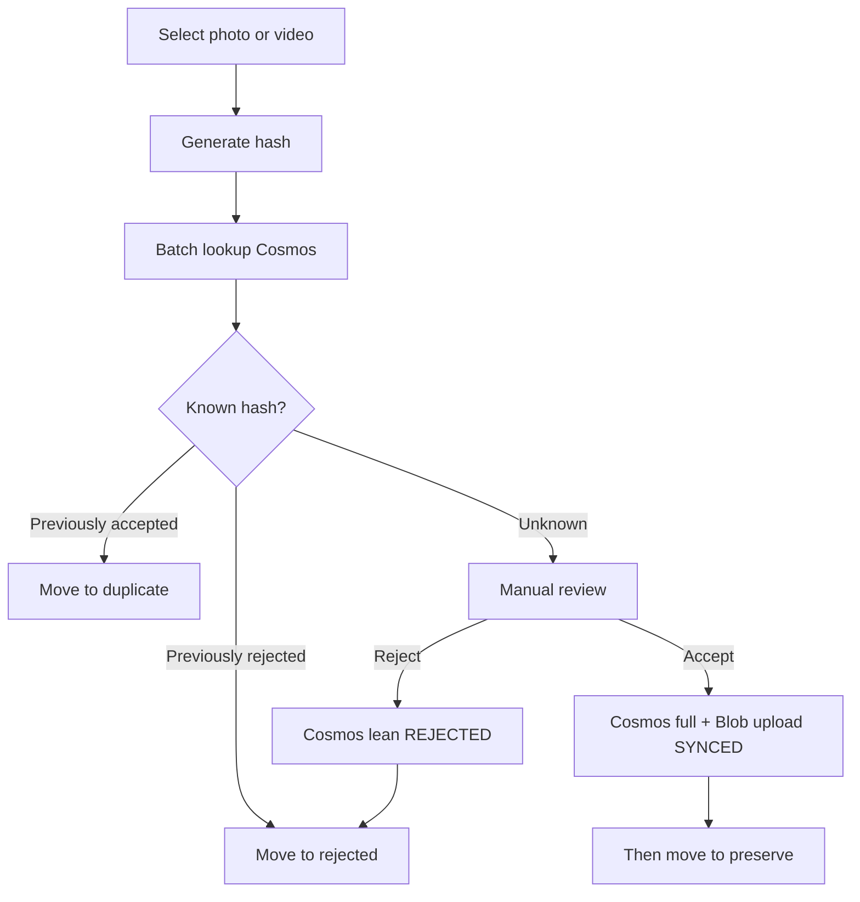
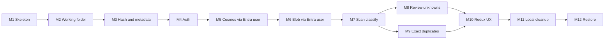

# ROADMAP.md

## Principles

- One clear goal per milestone
- Independently testable
- Do **not** implement future milestones early
- Each milestone leaves the product in a working incremental state
- **Cloud-backed desktop (solo MVP):** Entra user sign-in; desktop talks to **Cosmos** and **Blob** with the **user access token** (Azure RBAC)—**no** Azure Functions and **no** account keys in the app
- **No local SQL decision cache** — Cosmos is the decision store
- After each milestone: add/update tests and run them

Agents must read [AGENTS.md](AGENTS.md) and the current milestone only before coding.

## Media review workflow (product picture)

**Move rules:**

- **REJECTED** / **DUPLICATE** — move after decision confirmed in Cosms (lean write / accepted hit).
- **ACCEPTED** — Cosms + Blob `SYNCED`, **then** move to `preserve/`.

---

## Milestone 1 — Tooling skeleton

**Status:** Done.

---

## Milestone 2 — Working folder and safe moves

**Status:** Done.

---

## Milestone 3 — Content hash, metadata, size, and tags

**Status:** Done.

---

## Milestone 4 — Auth (Entra ID + PKCE)

**Goal:** Sign in from Electron; obtain access tokens without client secrets.

**Status:** Done.

**In scope (delivered):** Single-tenant Entra public client, PKCE/MSAL, main-process token cache, Graph `/me` stub, IDs in gitignored `.env`.

---

## Milestone 5 — Cosmos decisions via Entra user

**Goal:** Desktop batch-looks-up and upserts **accepted** (full) and **rejected** (lean) documents in Cosms using the **signed-in user’s** Azure AD token.

**Status:** Done.

**In scope (delivered):** Cosms adapter + decision repository (batch lookup / upsert accepted+rejected); reject DUPLICATE docs; MSAL Cosms scope; partition `userId` = Entra oid; harness upsert+lookup; mocked unit tests. No Functions / no account keys.

---

## Milestone 6 — Blob upload via Entra user

**Goal:** Upload accepted bytes to Blob with the user token; track `cloudStatus` through `SYNCED`.

**Status:** Done.

**In scope (delivered):** Blob adapter + accept/upload pipeline (`PENDING` → `UPLOADING` → `SYNCED`/`FAILED`); Cosms `cloudStatus`/`cloudObjectId` updates; harness Accept+upload; never move to `preserve/` in M6; mocked upload tests. No Functions / no account keys.

---

## Milestone 7 — Scan and classify known hashes (Cosmos)

**Goal:** Scan folders, hash files, batch-lookup Cosms, auto-move known decisions, skip unknowns.

**Status:** Done.

**In scope (delivered):** Media walk; batch Cosms lookup; REJECTED → `rejected/`; ACCEPTED → `duplicate/`; unknowns skipped; sign-in + network required (fails closed); progress events; harness + fixture tests. No Blob during scan; no review UI.

---

## Milestone 8 — Review unknowns (accept after cloud)

**Goal:** Accept/reject unknowns with Cosms-first accept path.

**Status:** Done.

**In scope (delivered):** Review queue + image preview; reject → Cosms lean → `rejected/`; accept → Cosms full → Blob `SYNCED` → then `preserve/`; upload failure leaves source unmoved; ordering tests. No offline queues / rich tag UI.

---

## Milestone 9 — Exact duplicate detection

**Goal:** Size candidates → SHA-256; duplicate only on hash match vs Cosms accepted / in-batch peers; move to `duplicate/`; no Cosms duplicate doc.

**Status:** Done.

**In scope (delivered):** Size-group peer candidates; classify duplicates only on SHA-256 match vs Cosms `ACCEPTED` or earlier scan peer; move to `duplicate/`; never write Cosms `DUPLICATE` docs; scan harness reports `duplicateOf`.

---

## Milestone 10 — Redux UX: progress, queues, settings

**Goal:** Polished UI state for progress, review queues, auth, settings.

---

## Milestone 11 — Local cleanup of rejected and duplicates

**Goal:** User-confirmed delete under `rejected/` / `duplicate/`; retain Cosms decisions.

---

## Milestone 12 — Download, restore, and preserve rebuild

**Goal:** Download accepted media with user token; hash verify; rebuild `preserve/YYYY/MM`.

---

## Explicitly postponed (after MVP)

- Azure Functions / API broker (reintroduce if multi-user or untrusted clients)
- Local SQL decision cache / offline decision catalog
- Encrypted Cosms/storage **account keys** in the desktop app
- Perceptual near-duplicates; mobile; multi-user sharing
- Automatic permanent deletion during scan/review

## Milestone dependency overview

## Superseded approaches

- Local SQLite decision cache and move-to-`preserve/` before cloud upload
- Azure Functions as required MVP gateway to Cosms/Blob
- Storing Cosms/storage account keys in the Electron app (encrypted file or otherwise)
